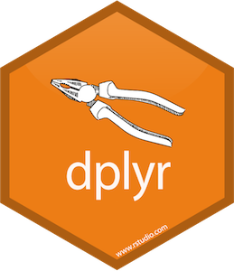

```{r setup, include=FALSE}
# R options
options(
  htmltools.dir.version = FALSE, # for blogdown
  show.signif.stars = FALSE,     # for regression output
  warm = 1
  )
# Set dpi and height for images
library(knitr)
opts_chunk$set(fig.height = 2.65, dpi = 300) 
# ggplot2 color palette with gray
color_palette <- list(gray = "#999999", 
                      salmon = "#E69F00", 
                      lightblue = "#56B4E9", 
                      green = "#009E73", 
                      yellow = "#F0E442", 
                      darkblue = "#0072B2", 
                      red = "#D55E00", 
                      purple = "#CC79A7")
# For nonsese...
library(emo)
htmltools::tagList(rmarkdown::html_dependency_font_awesome())
```

```{r echo=FALSE, message=FALSE, warning=FALSE}
library(tidyverse)
```

## Q&A

.small[
Q: Is using |> to perform everything in one step the standard way of doing analysis as opposed to making intermediate variables?    
A: Yup! Now, if you ever *want* access to an intermediate variable, that is encouraged. But, it's not used for every single step in the pipeline.

Q: Is there a difference in the piping process between the tidyverse "|>" and dplyr "%>%" packages? Also, is there a command that can be used the tidyverse's pipe "|>"? I know dpylr's command is Ctrl or Cmd + "M".  
A: We'll touch on this today! While cmd + shift + M works for the dplyr pipe, I don't think there is a baseR pipe shortcut (yet!). But, if you're used to using `%>%` feel free to continue to do so.

Q: Why is R markdown document called a markdown document?  
A: Because the text (outside of the code chunks) uses markdown syntax.
]
---

## [Ad] EDGE Outreach Program
.small[
EDGE, a free, year-long mentorship program offered to help introduce STEM-related fields to high school girls hosted by UCSD’s Society of Women Engineers and Women In Computing
 
As a mentor, you will be a resource to your mentee(s) for the duration of one school year and be expected to attend one virtual mentor-mentee meet-up event per quarter.

Sign up to be a mentor now at https://tinyurl.com/edgement2021! The deadline for mentor sign-ups is October 16, 2021 at 11:59 pm.
]
.pull-left[

]
.pull-right[

]
---
## Course Announcements

**Due Dates**:
- **Lab 02** due Friday 11:59 PM (now available)
- **HW 01** due Mon 10/11 11:59 PM

--

- **Lab 01** has been graded
  + Grades will be posted on Canvas after class
  + If you did not get full credit, you can request a regrade (this lab only) by Friday 11:59 PM
  + Regrades on thread in Campuswire
  .small[
  + Common Issues:
    + Submitted repo with no changes from template (did not push changes)
    + Did not update YAML to include your name
    + Did not change the descriptive text
  + Please knit your Rmd file to HTML (makes it easier to grade) and push both files to GitHub 
  ]
---

class: center, middle

# `dplyr`

---

## Agenda

- `dplyr`
  + philosophy
  + pipes
  + common operations

---

## Philosophy

> `dplyr` is a grammar of data manipulation, providing a consistent set of verbs that help you solve the most common data manipulation challenges 

.footnote[Source: [dplyr.tidyverse.org](https://dplyr.tidyverse.org/)]

---

class: center, middle

# Pipes

---

## The pipe in baseR

.small[

]

- `|>` should be read as "and then" 
- for example "Wake up |> brush teeth" would be read as wake up *and then* brush teeth
---

## Where does the name come from?

The pipe operator was *first* implemented in the package **magrittr**.

.pull-left[

]
.pull-right[

]

You will see this frequently in code online. It's equivalent to `|>`.


---

## Review: How does a pipe work?

- You can think about the following sequence of actions - find key, 
unlock car, start car, drive to school, park.

--

- Expressed as a set of nested functions in R pseudocode this would look like:

```{r eval=FALSE}
park(drive(start_car(find("keys")), to = "campus"))
```

--

- Writing it out using pipes give it a more natural (and easier to read) 
structure:

```{r eval=FALSE}
find("keys") |>
  start_car() |>
  drive(to = "campus") |>
  park()
```

---

class: center, middle

# Data

---

## NC DOT Fatal Crashes in North Carolina

From OpenDurham's Data Portal

```{r load-data-real,include=FALSE}
bike <- read_csv2("data/nc_bike_crash.csv", na = c("NA", "", "."))
```

```{r load-data-fake, eval=FALSE}
bike <- read_csv2("https://raw.githubusercontent.com/COGS137/datasets/main/nc_bike_crash.csv", 
                  na = c("NA", "", "."))
```

---

## Variables

View the names of variables via
```{r}
names(bike)
```

---

## Viewing your data

- In the Environment, click on the name of the data frame to view
it in the data viewer

- Use the `glimpse` function to take a peek

.small[
```{r}
glimpse(bike)
```
]
---

## A Grammar of Data Manipulation

**dplyr** is based on the concepts of functions as verbs that manipulate data frames.

Single data frame functions / verbs:

.small[
* `filter`: pick rows matching criteria
* `slice`: pick rows using index(es)
* `select`: pick columns by name
* `pull`: grab a column as a vector
* `rename`: rename specific columns
* `arrange`: reorder rows
* `mutate`: add new variables
* `transmute`: create new data frame with variables
* `distinct`: filter for unique rows
* `sample_n` / `sample_frac`: randomly sample rows
* `summarise`: reduce variables to values
* ... (many more)
]

---

## **dplyr** rules for functions

1. First argument is *always* a data frame

2. Subsequent arguments say what to do with that data frame

3. Always return a data frame

4. Do not modify in place

5. Performance via lazy evaluation

---

## Filter rows with `filter`

- Select a subset of rows in a data frame.
- Easily filter for many conditions at once.

---

## `filter`

for crashes in Durham County

```{r}
bike |>
  filter(County == "Durham")
```

---

## `filter`

for crashes in Durham County where biker was < 10 yrs old

```{r}
bike |>
  filter(County == "Durham", Bike_Age < 10)
```

---

## Aside: real data is messy!

.question[
What in the world does a `BikeAge_gr` of `10-Jun` or `15-Nov` mean?
]

.small[
```{r}
bike |>
  group_by(BikeAge_Gr) |>
  summarise(crash_count = n())
```
]

---

## Careful data scientists clean up their data first!

- We're going to need to do some text parsing to clean up these data
    + `10-Jun` should be `6-10`
    + `15-Nov` should be `11-15`

---

## Correct and overwrite `mutate`

- Remember we want to do the following in the `BikeAge_Gr` variable
    + `10-Jun` should be `6-10`
    + `15-Nov` should be `11-15`
 
```{r}
bike <- bike |>
  mutate(
    BikeAge_Gr = case_when(
      BikeAge_Gr == "10-Jun" ~ "6-10",
      BikeAge_Gr == "15-Nov" ~ "11-15",
      TRUE                   ~ BikeAge_Gr     # everything else
    )
  )
```

- Note that we're overwriting existing data and columns, so be careful!
    + But remember, it's easy to revert if you make a mistake since we didn't
    touch the raw data, we can always reload it and start over

---

## Check before you move on

Always check your changes and confirm code did what you wanted it to do

```{r}
bike |>
  group_by(BikeAge_Gr) |>
  summarise(count = n())
```

---

## `mutate` to add new variables

.question[
How is the new `alcohol` variable determined?
]

```{r eval=FALSE}
bike |>
  mutate(alcohol = case_when(
    Bike_Alc_D == "No" & Drvr_Alc_D == "No"      ~ "No",
    Bike_Alc_D == "Yes" | Drvr_Alc_D == "Yes"    ~ "Yes",
    Bike_Alc_D == "Missing" & Drvr_Alc_D == "No" ~ "Missing",
    Bike_Alc_D == "No" & Drvr_Alc_D == "Missing" ~ "Missing"
  ))
```

---

## "Save" when you `mutate`

Most often when you define a new variable with `mutate` you'll also want to save the resulting data frame, often by writing over the original data frame.

```{r eval=FALSE}
bike <- bike |>
  mutate(alcohol = case_when(
    Bike_Alc_D == "No" & Drvr_Alc_D == "No"      ~ "No",
    Bike_Alc_D == "Yes" | Drvr_Alc_D == "Yes"    ~ "Yes",
    Bike_Alc_D == "Missing" & Drvr_Alc_D == "No" ~ "Missing",
    Bike_Alc_D == "No" & Drvr_Alc_D == "Missing" ~ "Missing"
  ))
```

---

## `transmute` to create a new dataset

You'll use this much less often than `mutate` but when you need it, you need it.

```{r}
bike |> 
  transmute(ID = paste(FID, OBJECTID, sep = "-"))
```

---

# `mutate` vs. `transmute`

- `mutate` adds new and keeps original
- `transmute` adds new; drops existing

---

## `slice` for certain row numbers

First five
```{r}
bike |>
  slice(1:5)
```

---

## `slice` for certain row numbers

Last five
```{r}
last_row <- nrow(bike)
bike |>
  slice((last_row - 4):last_row)
```

---

## `select` to keep only the variables you mention

```{r}
bike |>
  select(Crash_Loc, Hit_Run) |>
  table()
```

---

## or `select` to exclude variables

```{r}
bike |>
  select(-OBJECTID)
```

---

## or `select` a range of variables

```{r}
bike |>
  select(OBJECTID:Bike_Injur)
```

---

## `pull` to extract a column as a vector

```{r}
bike |>
  slice(1:6) |>
  pull(Location)
```

```{r}
bike |>
  slice(1:6) |>
  select(Location)
```

---

## The two `pull`s in your lives

.pull-left[

]
.pull-right[

]

- Don't get `pull` happy when wrangling data! Only extract out variables if you truly need to, otherwise keep in data frame.

- But always `r emo::ji("arrow_down")` `Pull` before starting your work when collaborating on GitHub.

---

## `rename` specific columns

Useful for correcting typos, and renaming to make variable names shorter 
and/or more informative

- Original names:
.small[
```{r}
names(bike)
```
]

---

## `rename` specific columns

- Rename `Speed_Limi` to `Speed_Limit`:
.small[
```{r}
bike <- bike |>
  rename(Speed_Limit = Speed_Limi)
```
]
---

## Check before you move on

Always check your changes and confirm code did what you wanted it to do

.small[
```{r}
names(bike)
```
]

---

## `summarise` to reduce variables to values

The values are summarised in a data frame

```{r}
bike |>
  group_by(BikeAge_Gr) |>
  summarise(crash_count = n())
```

---

## and `arrange` to order rows

```{r}
bike |>
  group_by(BikeAge_Gr) |>
  summarise(crash_count = n()) |>
  arrange(desc(crash_count))
```

---

## `count` to group by then count

.small[
```{r}
bike |>
  count(BikeAge_Gr)
```
]

.question[
If you wanted to arrange these in ascending order what would you add to the pipe?
]

---

## Select rows with `sample_n` or `sample_frac`

- `sample_n`: randomly sample 5 observations

```{r}
bike_n5 <- bike |>
  sample_n(5, replace = FALSE)
dim(bike_n5)
```

- `sample_frac`: randomly sample 20% of observations

```{r}
bike_perc20 <- bike |>
  sample_frac(0.2, replace = FALSE)
dim(bike_perc20)
```

---

## `distinct` to filter for unique rows

```{r}
bike |> 
  select(County, City) |> 
  distinct() |> 
  arrange(County, City)
```

---

## `distinct` has a .keep_all parameter

```{r}
bike |> 
  distinct(County, City, .keep_all = TRUE) |> 
  arrange(County, City)
```

## Recap
- Understand the basic tenants of `dplyr`
- Describe and utilize the pipe in workflows
- Describe and use common `verbs` (functions)
- Understand the documentation for `dplyr` functions