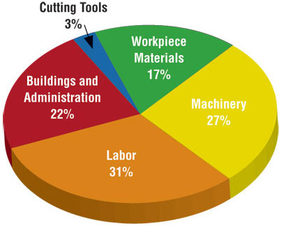

## Q&A

.small[
Q: How would you specify the increments of the axes?  
A: The layer that controls this would be ` scale_*_discrete()` or ` scale_*_continuous()`, where `*` is either `x` or `y`, depending on which axis you want to ontrol. More details [here](http://www.sthda.com/english/wiki/ggplot2-axis-ticks-a-guide-to-customize-tick-marks-and-labels).

Q: Is calling ggplot separate from the geom_line call from lecture, since there was also the idea of layering by using the '+' operator to chain multiple commands together.  
A: So, it depends what you mean by separate. If you mean do you *need* the `geom_` call....technically no, but no points/lines/shapes will show up on your plot. So, any time we make a plot there will be a `ggplot` + `geom_` call.

Q: Just wanted to say that on the course website, the section for lab answers currently says "Kab Answers"  
A: Thanks! In a shocking turn of events I *actually* noticed that and updated it on my computer...and forgot to push those changes. I really appreciate these types of comments; I always want these things fixed!
]

---
## Course Announcements

**Due Dates**:
- **Midterm** is due on Mon (11:59 PM; will be posted Friday afternoon)
- **HW 02** is now available (due Mon 10/25)
- **Lab 01** regrades now complete
- **Lab 02** answers posted on website; grading underway


```{r child = "setup.Rmd"}
```

```{r packages, echo = FALSE, message=FALSE, warning=FALSE}
library(tidyverse)
library(scales)
```

class: middle

# Designing effective visualizations

.footnote[Slides modified from [datascienceinabox.org](https://datasciencebox.org/)]
---

## Keep it simple

.pull-left-narrow[
```{r pie-3d, echo = FALSE, out.width="100%"}

```
]
.pull-right-wide[
```{r pie-to-bar, echo = FALSE, out.width="100%"}
d <- tribble(
  ~category, ~value,
  "Cutting tools", 0.03,
  "Buildings and administration", 0.22,
  "Labor", 0.31,
  "Machinery", 0.27,
  "Workplace materials", 0.17
)
ggplot(d, aes(x = fct_reorder(category, value), y = value)) +
  geom_col() +
  theme_minimal() +
  coord_flip() +
  labs(x = "", y = "")
```
]


---

## Use	color	to	draw	attention

.pull-left[
```{r echo = FALSE, out.width="100%"}
d |>
  mutate(category = str_replace(category, " ", "\n")) |>
  ggplot(aes(x = category, y = value, fill = category)) +
  geom_col() +
  theme_minimal() +
  labs(x = "", y = "") +
  theme(legend.position = "none")
```
]
.pull-right[
```{r echo = FALSE, out.width="100%"}
ggplot(d, aes(x = fct_reorder(category, value), y = value, fill = category)) +
  geom_col() +
  theme_minimal() +
  coord_flip() +
  labs(x = "", y = "") +
  scale_fill_manual(values = c("red", rep("gray", 4))) +
  theme(legend.position = "none")
```
]

---

## Tell a story

```{r echo = FALSE, out.width = "100%"}
knitr::include_graphics("img/06/time-series-story.png")
```

.footnote[
Credit: Angela Zoss and Eric Monson, Duke DVS
]

---

class: middle

# Principles	for	effective	visualizations

---

## Principles	for	effective	visualizations

- Order matters
- Put long categories on the y-axis
- Keep	scales consistent
- Select meaningful colors
- Use meaningful and nonredundant labels

---

## Data

In September 2019, YouGov survey asked 1,639 GB adults the following question:

.pull-left[
> In hindsight, do you think Britain was right/wrong to vote to leave EU?
>
>- Right to leave  
>- Wrong to leave  
>- Don't know

]
.pull-right[
```{r echo = FALSE}
brexit <- tibble(
  opinion = c(
    rep("Right", 664), rep("Wrong", 787), rep("Don't know", 188)
  ),
  region = c(
    rep("london", 63), rep("rest_of_south", 241), rep("midlands_wales", 145), rep("north", 176), rep("scot", 39),
    rep("london", 110), rep("rest_of_south", 257), rep("midlands_wales", 152), rep("north", 176), rep("scot", 92),
    rep("london", 24), rep("rest_of_south", 49), rep("midlands_wales", 57), rep("north", 48), rep("scot", 10)
  )
)
```

```{r echo = FALSE, out.width="100%"}
ggplot(brexit, aes(x = opinion)) +
  geom_bar()
```
]

.footnote[ 
Source: [YouGov Survey Results](https://d25d2506sfb94s.cloudfront.net/cumulus_uploads/document/x0msmggx08/YouGov%20-%20Brexit%20and%202019%20election.pdf), retrieved Oct 7, 2019
]

---

## The Data: Code

```{r, eval=FALSE}
brexit <- tibble(
  opinion = c(
    rep("Right", 664), rep("Wrong", 787), rep("Don't know", 188)
  ),
  region = c(
    rep("london", 63), rep("rest_of_south", 241), rep("midlands_wales", 145), rep("north", 176), rep("scot", 39),
    rep("london", 110), rep("rest_of_south", 257), rep("midlands_wales", 152), rep("north", 176), rep("scot", 92),
    rep("london", 24), rep("rest_of_south", 49), rep("midlands_wales", 57), rep("north", 48), rep("scot", 10)
  )
)
```


---

class: middle

# Order matters

---

## Alphabetical order is rarely ideal

.panelset[

.panel[.panel-name[Plot]
```{r ref.label="default-opinion", echo = FALSE}
```
]

.panel[.panel-name[Code]
```{r default-opinion, fig.show = "hide"}
ggplot(brexit, aes(x = opinion)) +
  geom_bar()
```
]

]

---

## Order by frequency

.panelset[

.panel[.panel-name[Plot]
```{r ref.label="infreq", echo = FALSE}
```
]

.panel[.panel-name[Code]

`fct_infreq`: Reorder factors' levels by frequency

```{r infreq, fig.show = "hide"}
ggplot(brexit, aes(x = fct_infreq(opinion))) + #<<
  geom_bar()
```
]

]

---

## Clean up labels

.panelset[

.panel[.panel-name[Plot]
```{r ref.label="labels", echo = FALSE}
```
]

.panel[.panel-name[Code]

```{r labels, fig.show = "hide"}
ggplot(brexit, aes(x = opinion)) +
  geom_bar() +
  labs( #<<
    x = "Opinion", #<<
    y = "Count" #<<
  ) #<<
```
]

]

---

## Alphabetical order is rarely ideal

.panelset[

.panel[.panel-name[Plot]
```{r ref.label="region-default", echo = FALSE}
```
]

.panel[.panel-name[Code]

```{r region-default, fig.show = "hide"}
ggplot(brexit, aes(x = region)) +
  geom_bar()
```
]

]

---

## Use inherent level order

.panelset[

.panel[.panel-name[Relevel]

`fct_relevel`: Reorder factor levels using a custom order

```{r relevel, fig.show = "hide"}
brexit <- brexit |>
  mutate(
    region = fct_relevel( #<<
      region,
      "london", "rest_of_south", "midlands_wales", "north", "scot"
    )
  )
```
]

.panel[.panel-name[Plot]
```{r echo=FALSE}
ggplot(brexit, aes(x = region)) +
  geom_bar()
```
]

]

---

## Clean up labels

.panelset[

.panel[.panel-name[Recode]

`fct_recode`: Change factor levels by hand

```{r recode, fig.show = "hide"}
brexit <- brexit |>
  mutate(
    region = fct_recode( #<<
      region,
      London = "london",
      `Rest of South` = "rest_of_south",
      `Midlands / Wales` = "midlands_wales",
      North = "north",
      Scotland = "scot"
    )
  )
```
]

.panel[.panel-name[Plot]
```{r recode-plot, echo=FALSE}
ggplot(brexit, aes(x = region)) +
  geom_bar()
```
]

]

---

class: middle

# Put long categories on the y-axis

---

## Long categories can be hard to read

```{r ref.label="recode-plot", echo = FALSE}
```

---

## Move them to the y-axis

.panelset[

.panel[.panel-name[Plot]
```{r ref.label="flip", echo = FALSE}
```
]

.panel[.panel-name[Code]

```{r flip, fig.show = "hide"}
ggplot(brexit, aes(y = region)) + #<<
  geom_bar()
```
]

]

---

## And reverse the order of levels

.panelset[

.panel[.panel-name[Plot]
```{r ref.label="rev", echo = FALSE}
```
]

.panel[.panel-name[Code]

`fct_rev`: Reverse order of factor levels

```{r rev, fig.show = "hide"}
ggplot(brexit, aes(y = fct_rev(region))) + #<<
  geom_bar()
```
]

]

---

## Clean up labels

.panelset[

.panel[.panel-name[Plot]
```{r ref.label="labels-again", echo = FALSE}
```
]

.panel[.panel-name[Code]

```{r labels-again, fig.show = "hide"}
ggplot(brexit, aes(y = fct_rev(region))) +
  geom_bar() +
  labs( #<<
    x = "Count", #<<
    y = "Region" #<<
  ) #<<
```
]

]

---

class: middle

# Pick a purpose

---

## Segmented bar plots can be hard to read

.panelset[

.panel[.panel-name[Plot]
```{r ref.label="segment", echo = FALSE}
```
]

.panel[.panel-name[Code]

```{r segment, fig.show = "hide"}
ggplot(brexit, aes(y = region, fill = opinion)) + #<<
  geom_bar()
```
]

]

---

## Use facets

.panelset[

.panel[.panel-name[Plot]
```{r ref.label="facet", echo = FALSE, fig.asp = 0.45, out.width = "90%"}
```
]

.panel[.panel-name[Code]

```{r facet, fig.show = "hide"}
ggplot(brexit, aes(y = opinion, fill = region)) +
  geom_bar() +
  facet_wrap(~region, nrow = 1) #<<
```
]

]

---

## Avoid redundancy?

```{r echo = FALSE, fig.asp = 0.45, out.width = "90%"}
ggplot(brexit, aes(y = opinion)) +
  geom_bar() +
  facet_wrap(~region, nrow = 1)
```

---

## Redundancy can help tell a story

.panelset[

.panel[.panel-name[Plot]
```{r ref.label="facet-fill", echo = FALSE, fig.asp = 0.45, out.width = "90%"}
```
]

.panel[.panel-name[Code]

```{r facet-fill, fig.show = "hide"}
ggplot(brexit, aes(y = opinion, fill = opinion)) +
  geom_bar() +
  facet_wrap(~region, nrow = 1)
```
]

]

---

## Be selective with redundancy

.panelset[

.panel[.panel-name[Plot]
```{r ref.label="hide-legend", echo = FALSE, fig.asp = 0.45, out.width = "90%"}
```
]

.panel[.panel-name[Code]

```{r hide-legend, fig.show = "hide"}
ggplot(brexit, aes(y = opinion, fill = opinion)) +
  geom_bar() +
  facet_wrap(~region, nrow = 1) +
  guides(fill = "none") #<<
```
]

]

---

## Use informative labels

.panelset[

.panel[.panel-name[Plot]
```{r ref.label="informative-label", echo = FALSE, fig.asp = 0.45, out.width = "90%"}
```
]

.panel[.panel-name[Code]

```{r informative-label, fig.show = "hide"}
ggplot(brexit, aes(y = opinion, fill = opinion)) +
  geom_bar() +
  facet_wrap(~region, nrow = 1) +
  guides(fill = "none") +
  labs(
    title = "Was Britain right/wrong to vote to leave EU?", #<<
    x = NULL, y = NULL
  )
```
]

]

---

## A bit more info

.panelset[

.panel[.panel-name[Plot]
```{r ref.label="more-info", echo = FALSE, fig.asp = 0.45, out.width = "90%"}
```
]

.panel[.panel-name[Code]

```{r more-info, fig.show = "hide"}
ggplot(brexit, aes(y = opinion, fill = opinion)) +
  geom_bar() +
  facet_wrap(~region, nrow = 1) +
  guides(fill = "none") +
  labs(
    title = "Was Britain right/wrong to vote to leave EU?",
    subtitle = "YouGov Survey Results, 2-3 September 2019", #<<
    caption = "Source: https://d25d2506sfb94s.cloudfront.net/cumulus_uploads/document/x0msmggx08/YouGov%20-%20Brexit%20and%202019%20election.pdf", #<<
    x = NULL, y = NULL
  )
```
]

]

---

## Let's do better

.panelset[

.panel[.panel-name[Plot]
```{r ref.label="short-link", echo = FALSE, fig.asp = 0.45, out.width = "90%"}
```
]

.panel[.panel-name[Code]

```{r short-link, fig.show = "hide"}
ggplot(brexit, aes(y = opinion, fill = opinion)) +
  geom_bar() +
  facet_wrap(~region, nrow = 1) +
  guides(fill = "none") +
  labs(
    title = "Was Britain right/wrong to vote to leave EU?",
    subtitle = "YouGov Survey Results, 2-3 September 2019",
    caption = "Source: bit.ly/2lCJZVg", #<<
    x = NULL, y = NULL
  )
```
]

]

---

## Fix up facet labels

.panelset[

.panel[.panel-name[Plot]
```{r ref.label="label-wrap", echo = FALSE, fig.asp = 0.45, out.width = "90%"}
```
]

.panel[.panel-name[Code]

```{r label-wrap, fig.show = "hide"}
ggplot(brexit, aes(y = opinion, fill = opinion)) +
  geom_bar() +
  facet_wrap(~region,
    nrow = 1,
    labeller = label_wrap_gen(width = 12) #<<
  ) + 
  guides(fill = "none") +
  labs(
    title = "Was Britain right/wrong to vote to leave EU?",
    subtitle = "YouGov Survey Results, 2-3 September 2019",
    caption = "Source: bit.ly/2lCJZVg",
    x = NULL, y = NULL
  )
```
]

]

---

class: middle

# Select meaningful colors

---

## Rainbow colors not always the right choice

```{r ref.label="label-wrap", echo = FALSE, fig.asp = 0.45, out.width = "90%"}
```

---

## Manually choose colors when needed

.panelset[

.panel[.panel-name[Plot]
```{r ref.label="red-green", echo = FALSE, fig.asp = 0.45, out.width = "90%"}
```
]

.panel[.panel-name[Code]

```{r red-green, fig.show = "hide"}
ggplot(brexit, aes(y = opinion, fill = opinion)) +
  geom_bar() +
  facet_wrap(~region, nrow = 1, labeller = label_wrap_gen(width = 12)) +
  guides(fill = "none") +
  labs(title = "Was Britain right/wrong to vote to leave EU?",
       subtitle = "YouGov Survey Results, 2-3 September 2019",
       caption = "Source: bit.ly/2lCJZVg",
       x = NULL, y = NULL) +
  scale_fill_manual(values = c( #<<
    "Wrong" = "red", #<<
    "Right" = "green", #<<
    "Don't know" = "gray" #<<
  )) #<<
```
]

]

---

## Choosing better colors

.center[.large[
[colorbrewer2.org](https://colorbrewer2.org/)
]]

```{r echo = FALSE, out.width = "60%"}
knitr::include_graphics("img/06/color-brewer.png")
```

---

## Use better colors

.panelset[

.panel[.panel-name[Plot]
```{r ref.label="color-brewer", echo = FALSE, fig.asp = 0.45, out.width = "90%"}
```
]

.panel[.panel-name[Code]

```{r color-brewer, fig.show = "hide"}
ggplot(brexit, aes(y = opinion, fill = opinion)) +
  geom_bar() +
  facet_wrap(~region, nrow = 1, labeller = label_wrap_gen(width = 12)) +
  guides(fill = "none") +
  labs(title = "Was Britain right/wrong to vote to leave EU?",
       subtitle = "YouGov Survey Results, 2-3 September 2019",
       caption = "Source: bit.ly/2lCJZVg",
       x = NULL, y = NULL) +
  scale_fill_manual(values = c(
    "Wrong" = "#ef8a62", #<<
    "Right" = "#67a9cf", #<<
    "Don't know" = "gray" #<<
  ))
```
]

]

---

## Select theme

.panelset[

.panel[.panel-name[Plot]
```{r ref.label="theme", echo = FALSE, fig.asp = 0.45, out.width = "90%"}
```
]

.panel[.panel-name[Code]

```{r theme, fig.show = "hide"}
ggplot(brexit, aes(y = opinion, fill = opinion)) +
  geom_bar() +
  facet_wrap(~region, nrow = 1, labeller = label_wrap_gen(width = 12)) +
  guides(fill = "none") +
  labs(title = "Was Britain right/wrong to vote to leave EU?",
       subtitle = "YouGov Survey Results, 2-3 September 2019",
       caption = "Source: bit.ly/2lCJZVg",
       x = NULL, y = NULL) +
  scale_fill_manual(values = c("Wrong" = "#ef8a62",
                               "Right" = "#67a9cf",
                               "Don't know" = "gray")) +
  theme_minimal() #<<
```
]

]

.footnote[`ggthemes` described [here](https://ggplot2.tidyverse.org/reference/ggtheme.html)]
---

## Customize theme

.panelset[

.panel[.panel-name[Plot]
```{r ref.label="theme-custom", echo = FALSE, fig.asp = 0.45, out.width = "90%"}
```
]

.panel[.panel-name[Code]

```{r theme-custom, fig.show = "hide"}
ggplot(brexit, aes(y = opinion, fill = opinion)) +
  geom_bar() +
  facet_wrap(~region, nrow = 1, labeller = label_wrap_gen(width = 12)) +
  guides(fill = "none") +
  labs(title = "Was Britain right/wrong to vote to leave EU?",
       subtitle = "YouGov Survey Results, 2-3 September 2019",
       caption = "Source: bit.ly/2lCJZVg",
       x = NULL, y = NULL) +
  scale_fill_manual(values = c("Wrong" = "#ef8a62",
                               "Right" = "#67a9cf",
                               "Don't know" = "gray")) +
  theme_minimal(base_size = 16) + #<<
  theme(plot.title.position = "plot", #<<
        panel.grid.major.y = element_blank()) #<<
```
]

]

---

## Your Turn

- Read in the data (slide #11)
- Think of at least three different ways to tell slightly different stories with these data
- Try to implement at least one of these ideas!
