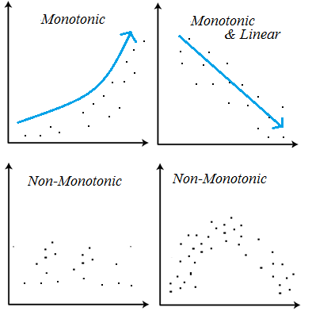

```{r packages, echo=FALSE, message=FALSE, warning=FALSE}
library(tidyverse)

# For nonsese...
library(emo)
library(DT)
library(broom)
library(Kendall)
```

```{r child = "setup.Rmd"}
```

## Q&A

.small[
Q: Is the pivot function we used in the class example today like transpose in linear algebra where we switch the rows and columns?  
A: Great question! And not quite. There is the ability to transpose in R/dplyr; however, `pivot_*` does something different. In a transpose, the matrix/dataframe you start and end with have the reverse dimensions of one another (for example 5x3 gets transposed to 3x5). In a pivot, that's not the case. Rather, we are taking information from a "wide" format to a "long" format (or the reverse). The same information is included before and after, but the formatting differs. A simpler example (than what was used in class) likely helpful! Take a look at the `relig_income` dataframe (available from `tidyr` in the` tidyverse`). It has 18 rows and 11 columns. After `relig_income |> pivot_longer(!religion, names_to = "income", values_to = "count")` we see there are 180 rows and 3 columns. Same information. But, all those columns are summarized within the `count` column and the column information is in `income`.
]

---

## Course Announcements

**Case Study Details**:
- lab05 due tonight
- hw03 due Monday (11/1)
- [**Mid-course Survey**](https://docs.google.com/forms/d/e/1FAIpQLScyO_RW1yfvVtDX160kbzh2dwDaD_4EI4HaQWaYN0uueWve2A/viewform?usp=sf_link) (*optional*; due Mon 11/1 for extra credit)
- Podcast/lecture videos now available in "Media Gallery" on canvas (subtitles possible there)

---

Setup

```{r, eval = FALSE}
install.packages("Kendall")

library(tidyverse)
library(broom)
library(Kendall)
```

---

## Questions

1. How have youth disconnection rates in American youth changed since 2008?
2. In particular, how has this changed for different gender and ethnic groups? Are any groups particularly disconnected?

---

## The Data

- pooled, cross-sectional data
- repeated measurements from a population over time
- individuals from one year to the next are *not* the same (pooled, cross-sectional vs. panel data)
- allow us to calculate estimates of population-level statistics

---

## The Data

.small[
```{r, echo=FALSE}
major_groups_long <- read_csv("data/wrangled_major_groups_data.csv")

DT::datatable(major_groups_long)
```
]

---

## EDA: Disonnection over time

.panelset[

.panel[.panel-name[Plot]
```{r ref.label="eda-overall", echo = FALSE, out.width="100%"}
```
]
.panel[.panel-name[Code]
```{r eda-overall, fig.show = "hide"}
major_groups_long |>
  filter(Gender == "All", Race_Ethnicity == "All_races") |>
  ggplot(aes(x = Year, y = Percent)) +
    geom_line(size = 0.5) +
    geom_point(size = 3) 
```
]


]

---

## Q1 

**Q1**. How have youth disconnection rates in American youth changed since 2008?

- approach 1: describe the trend from the visualization
- approach 2: statistical approach

--

.question[`r emo::ji("backhand index pointing right")` **Your Turn**: How would you describe this trend? How would you approach this statistically?]

.whisper[Put a green sticky on the front of your computer when you're done. Put a pink if you want help/have a question.]

---

## Linear regression? 

.panelset[

.panel[.panel-name[Plot]
```{r ref.label="lm-se", echo = FALSE, out.width="100%"}
```
]
.panel[.panel-name[Code]
```{r lm-se, fig.show = "hide"}
major_groups_long |>
  filter(Gender == "All", Race_Ethnicity == "All_races") |>
  ggplot(aes(x = Year, y = Percent)) +
    geom_point(size = 3) +
    geom_smooth(method = "lm", se=FALSE)
```
]


]

---

## Certainty?

.panelset[

.panel[.panel-name[Plot]
```{r ref.label="lm", echo = FALSE, out.width="100%"}
```
]
.panel[.panel-name[Code]
```{r lm, fig.show = "hide"}
major_groups_long |>
  filter(Gender == "All", Race_Ethnicity == "All_races") |>
  ggplot(aes(x = Year, y = Percent)) +
    geom_point(size = 3) +
    geom_smooth(method = "lm")
```
]


]

---

## Nonparametric approach?
**Mann-Kendall trend test**

- tests whether there is a *monotonic association* between time
- typically used to determine if there is a consistent change in direction across time
- compares relative magnitudes; not data point values themselves
- only checks direction, NOT rate
- requires at least 4 data points; more than 8 recommended

---

## Monotonic Association



.footnote[source - Stephanie Glen. “Monotonic Relationship: Definition” From StatisticsHowTo.com: Elementary Statistics for the rest of us! https://www.statisticshowto.com/monotonic-relationship/]

---

## Mann-Kendall vs. Linear Regression

- ** Linear regression**: is there a *consistent change in both rate and direction* in the dependent variable as a single independent variable changes. The coefficients tell us how much the dependent variable changes with one unit change of the independent variable.

- **Mann-Kendall trend test** is a nonparametric test, which means that it does not require as many assumptions as some parametric tests, but *only checks for direction*

---

## Mann-Kendall Hypotheses

- $H_0$: Data are NOT consistently increasing/decreasing (no monotonic trend)
- $H_a$: Data are consistently increasing/decreasing (there is a monotonic trend)

---

### Calculating the $S$ score

$$S =\sum_{k=1}^{n-1}\sum_{j = k+1}^{n} sign(x_{j} - x_{k})$$


We assume there are:
- $n$ time points;
- observations $x_j$ and $x_k$ at two time points; and
- $sign(x_{j}-x_{k}) = 1 \text{, if } x_{j}-x_{k}>0$
- $sign(x_{j}-x_{k}) = 0 \text{, if } x_{j}-x_{k}=0$
- $sign(x_{j}-x_{k}) = -1 \text{, if } x_{j}-x_{k}<0$

.small[
> The data values are evaluated as an ordered time series. Each data value is compared to all subsequent data values. The initial value of the Mann-Kendall statistic, $S$, is assumed to be 0 (e.g., no trend). If a data value from a later time period is higher than a data value from an earlier time period, S is incremented by 1. On the other hand, if the data value from a later time period is lower than a data value sampled earlier, $S$ is decremented by 1. The net result of all such increments and decrements yields the final value of $S$. <supp>1</supp>
]

<supp>1</supp>[](https://www.statisticshowto.com/wp-content/uploads/2016/08/Mann-Kendall-Analysis-1.pdf)

--- 

## In other words...

all time points must be compared with *all previous time points*.

For example, if you had 4 data points: 

$$S = sign(x_2−x_1) + sign(x_3−x_1) + sign(x_4-x_1) + sign(x_3−x_2) + sign(x_4-x_2) + sign(x_4-x_3)$$

...or $4(4-1)/2 = 4(3)/2 = 12/2 = 6$ comparisons.

---

## How to know if $S$ is meaningful?

Need to know the variance!

$$\text{var}(S)=\frac{1}{18}(n(n−1)(2n+5)−\sum_{p-1}^{g}t_{p}(t_{p}−1)(2t_{p}+5))$$

.small[
where: 

- $g =  \text{number of tied groups}$
- $t_{p} =  \text{number of observations in the }p^{th}\text{ group for a given tie}$
]

--

For example, if 3 observations in our 4 observation example were 35, then there would be 1 $g$ tied group and 3 $t_{p}$ observations.

--

.small[
where $Z_{MK}$ is a Z score:

 if $S > 0$ then $Z_{MK} = \frac{S-1}{\sqrt{\text{var}(S)}}$  
 if $S < 0$ then $Z_{MK} = \frac{S+1}{\sqrt{\text{var}(S)}}$  
 if $S = 0$ then $Z_{MK} = 0$  
]
---
 
## M-K test in R

[Parsnip models](https://www.tidymodels.org/find/parsnip/)

```{r}
major_groups_long |>
  filter(Gender == "All", Race_Ethnicity == "All_races") |>
  pull(Percent) |>
  MannKendall() |>
  tidy()
```
.small[
- $S$ = -9
  - the larger the absolute value, the more evidence there is for monotonicity
- p-value is 0.133 
  - 13.3% chance of seeing these results or results more extreme due to chance alone
]

--
.small[
- fail to reject our null hypothesis...there is no consistent negative trend
]
---

## Are there any groups/subgroups we're particularly interested in?

Note that for every statistical test you do, you have to adjust for multiple testing. To do this, adjust your significance threshold $\alpha$ to be $.05/(n\text{ tests})$. If you carried out two statistical tests, $0.5/2 = .025$

where:
- $\alpha$ is the amount of risk that you are willing to accept that a statistical test result is actually a false positive (Type 1 error)

--

- For each test, probability of making an error remains the same
- But...the probability overall *across tests* increases 
- So...the more tests you do, the more likely you are to find a significant result by chance alone
- ...thus the threshold for "significance" must become more stringent the more tests you run

---

## Conclusions:

There is no consistent negative trend in our data overall.

```{r, echo=FALSE}
major_groups_long |>
  filter(Gender == "All", Race_Ethnicity == "All_races") |>
  ggplot(aes(x = Year, y = Percent)) +
    geom_line(size = 0.5) +
    geom_point(size = 3) 
```


.question[`r emo::ji("idea")` Thoughts on our finding? ]

