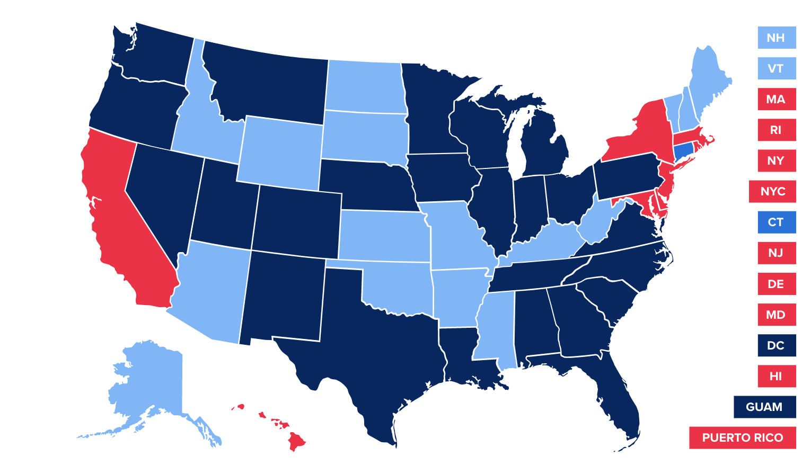
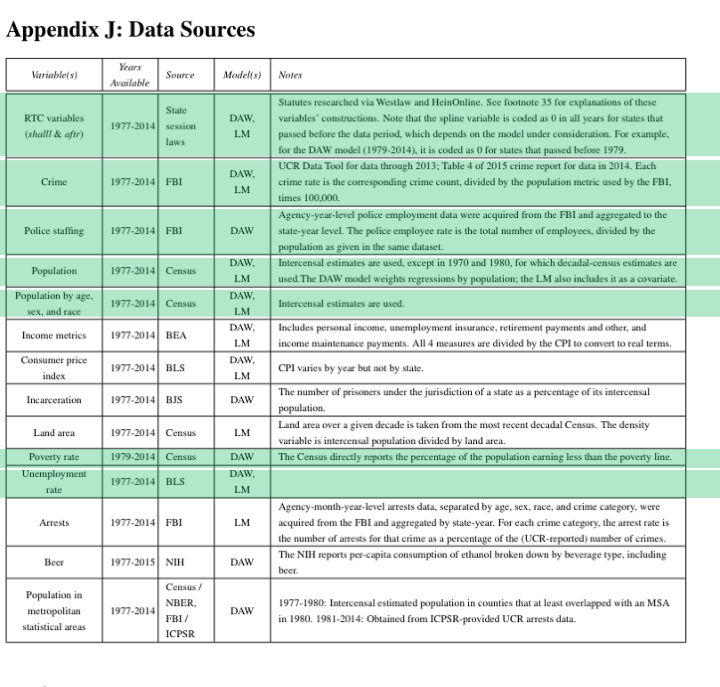
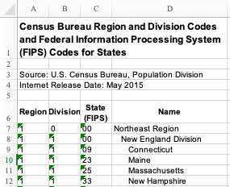
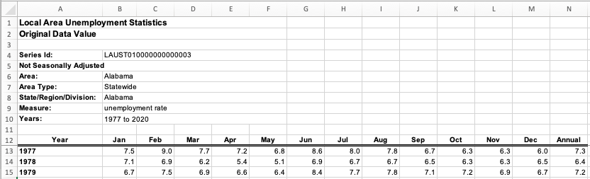

```{r child = "setup.Rmd"}
```

```{r packages, echo=FALSE, message=FALSE, warning=FALSE}
# For nonsese...
library(emo)
library(DT)

knitr::opts_chunk$set(warning=FALSE, message=FALSE) 
```

## Course Announcements

- **cs01** due tonight
- **lab07**: "due Friday" but accepted until Sunday night (multiple linear regression)

**Case Study 02**:
- **hw04**: CS02 Data Wrangling (due Mon 11/15) - submitted *individually*
  - Import, Wrangling, and explanation of a subset of datasets
  - Submitted by pushing to GitHub
- **cs02**: CS02 Final Case Study (due Mon 11/22) - submitted *as a group*
  - Group repos will be created later today
---

class: center, middle

# Background

---

## Right To Carry Laws<sup>1</sup>

.ocean[Tight to Carry (RTC) Laws] - "a law that specifies if and how citizens are allowed to have a firearm on their person or nearby (for example, in a citizen’s car) in public.<sup>2</sup>"

.footnote[
<sup>1</sup>Case Study Reference: Wright, Carrie and Ontiveros, Michael and Jager, Leah and Taub, Margaret and Hicks, Stephanie. (2020). https://github.com//opencasestudies/ocs-bp-RTC-analysis. Influence of Multicollinearity on Measured Impact of Right-to-Carry Gun Laws (Version v1.0.0).

<sup>2</sup>In this discussion, we will use the National Rifle Association (NRA) terminology. Please keep in mind that there are other terms that people use.

]

---

### RTC Laws (cont'd)

- The Second Amendment to the United States Constitution guarantees the right to “keep and bear arms”. The amendment was ratified in 1791 as part of the Bill of Rights.

--

- There are no federal laws about carrying firearms in public.

--

- These laws are created and enforced at the US state level. States vary greatly in their laws about the right to carry firearms.

--

-  Some require extensive effort to obtain a permit to legally carry a firearm, while other states require very minimal effort to do so. An increasing number of states do not require permits at all.


---

### RTC Laws Across the US


---


### RTC Laws Across the US




---

## Question

1. What is the effect of multicollinearity on coefficient estimates from linear regression models when analyzing right to carry laws and violence rates?

---

class: center, middle

# The Data

---

## The Data: Source<sup>1</sup>

Two contradictory analyses: 

.small[
1. John J. Donohue et al., Right‐to‐Carry Laws and Violent Crime: A Comprehensive Assessment Using Panel Data and a State‐Level Synthetic Control Analysis. Journal of Empirical Legal Studies, 16,2 (2019).

2. David B. Mustard & John Lott. Crime, Deterrence, and Right-to-Carry Concealed Handguns. Coase-Sandor Institute for Law & Economics Working Paper No. 41, (1996).
]

---

## The Data: 
.small[

]
---

## Two Analyses


---

## Limitations

1. The analyses differed in variables used; we will not be recreating either analysis in full

--

2. We'll account for either the adoption or lack of adoption of a permissive right-to-carry law in each state; we will not account for differences in the level of permissiveness of the laws.

--

3. Race is included here (as it was in initial analysis); however, any association between demographic variables (indicating the proportion of the population from specific race and age groups) and violent crime does not necessarily indicate that the two are linked causally.

---

# Packages 

```{r packages-load}
library(OCSdata) # if you didn't install this previously, you'll need to now
library(tidyverse)
library(pdftools)
library(readxl)
```

---

## Raw Data

There are a whole bunch of different data files we'll be using...

```{r, eval = FALSE}
# only get the data once
OCSdata::load_raw_data("ocs-bp-RTC-wrangling", outpath = '.')
```

- creates a "data" sub-directory in your current working directory (if it does not already exist)
- creates a "raw" sub-directory within "data"; contains the directories with the data

.question[`r emo::ji("backhand index pointing right")` **Your Turn**: Load the data into RStudio. It will take a while...so just let it get started.]

---

## Demographic & Population Data

.panelset[
.panel[.panel-name[Code]
.small[
```{r}
dem_77_79 <- read_csv("data/raw/Demographics/Decade_1970/pe-19.csv", skip = 5)

dem_80_89 <- list.files(recursive = TRUE,
                  path = "data/raw/Demographics/Decade_1980",
                  pattern = "*.csv",
                  full.names = TRUE) |> 
  purrr::map(~read_csv(., skip=5))

dem_90_99 <- list.files(recursive = TRUE,
                  path = "data/raw/Demographics/Decade_1990",
                  pattern = "*.txt",
                  full.names = TRUE) |> 
  map(~read_table2(., skip = 14))


dem_00_10 <- list.files(recursive = TRUE,
                  path = "data/raw/Demographics/Decade_2000",
                  pattern = "*.csv",
                   full.names = TRUE) |> 
   map(~read_csv(.))
```

Source: US Census Bureau Data
]
]
.panel[.panel-name[Data]
```{r}
glimpse(dem_00_10[[1]])
```
]
]

---

## State FIPS Codes
.panelset[
.panel[.panel-name[Image]

]
.panel[.panel-name[Code]
```{r}
STATE_FIPS <- readxl::read_xls("data/raw/State_FIPS_codes/state-geocodes-v2014.xls", skip = 5)
```
]
.panel[.panel-name[Data]
```{r}
glimpse(STATE_FIPS)
```
]
.panel[.panel-name[Wrangling]
```{r}
STATE_FIPS <- STATE_FIPS |>
  rename(STATEFP = `State\n(FIPS)`,
         STATE = Name) |>
  select(STATEFP, STATE) |>
  filter(STATEFP != "00")

STATE_FIPS
```
]]

---

## Police Staffing Data

.panelset[
.panel[.panel-name[Code]
```{r}
ps_data <- read_csv("data/raw/Police_staffing/pe_1960_2018.csv",
                    col_types =  cols(male_total_ct = col_double(),
                                      female_total_ct = col_double()))
```
]
.panel[.panel-name[Data]
```{r}
glimpse(ps_data)
```
]]

---

## Unemployment Data

.panelset[
.panel[.panel-name[Image]

]
.panel[.panel-name[Code-data]
```{r, message=FALSE}
 ue_rate_data <- list.files(recursive = TRUE,
                            path = "data/raw/Unemployment",
                            pattern = "*.xlsx",
                            full.names = TRUE) |> 
  map(~read_xlsx(., skip = 10))

```
]
.panel[.panel-name[Code-names]
```{r, message=FALSE}
ue_rate_names <- list.files(recursive = TRUE,
                            path = "data/raw/Unemployment",
                            pattern = "*.xlsx",
                            full.names = TRUE) %>%
  map(~read_xlsx(., range = "B4:B6")) %>%
  map(., c(1,2)) |>
  unlist()

names(ue_rate_data) <- ue_rate_names
```
]
.panel[.panel-name[Data]
```{r}
head(ue_rate_data)[1]
```
]
.panel[.panel-name[Wrangle]
```{r}
ue_rate_data <- ue_rate_data |>
  map_df(bind_rows, .id = "STATE") |>
  select(STATE, Year, Annual) |>
  rename("YEAR" = Year,
         "VALUE" = Annual) |>
  mutate(VARIABLE = "Unemployment_rate")

ue_rate_data
```

]
]
---

## Poverty Data

.panelset[
.panel[.panel-name[Code]
```{r, message=FALSE}
poverty_rate_data <- read_xls("data/raw/Poverty/hstpov21.xls", skip=2)
```
]
.panel[.panel-name[Data]
```{r}
head(poverty_rate_data)
```
]]

Source: US Census Bureau Data

---

## Violent Crime Data

.panelset[
.panel[.panel-name[Code]
```{r, message=FALSE}
crime_data <- read_lines("data/raw/Crime/CrimeStatebyState.csv",
                         skip = 2, 
                         skip_empty_rows = TRUE)
```

Due to spaces and `/` in the column names, `read_lines()` from the readr package works better than `read_csv()` 

]
.panel[.panel-name[Data]
```{r}
head(crime_data)
```
]]

---

## Right-To-Carry Data

.panelset[
.panel[.panel-name[Code]
```{r, message=FALSE}
DAWpaper <- pdf_text("data/raw/w23510.pdf")
```


]
.panel[.panel-name[Data]
```{r}
head(DAWpaper[1])
```
]]

---

## Save (Imported) Data

```{r}
save(dem_77_79, dem_80_89, dem_90_99, dem_00_10, #demographic data
     STATE_FIPS, # codes for states 
     ps_data, # police staffing data
     ue_rate_data, # unemployment data
     poverty_rate_data, # poverty data
     crime_data, # crime data
     DAWpaper, file = "data/imported_data_rtc.rda")
```

---

## Wrangle: Demo Data I

.panelset[
.panel[.panel-name[77-79-1]
.small[
```{r}
dem_77_79 <- dem_77_79 |>
  rename("race_sex" =`Race/Sex Indicator`) |>
  mutate(SEX = str_extract(race_sex, "male|female"),
        RACE = str_extract(race_sex, "Black|White|Other"))|>
  select(-`FIPS State Code`, -`race_sex`) |>
  rename("YEAR" = `Year of Estimate`,
        "STATE" = `State Name`) |>
  filter(YEAR %in% 1977:1979)

dem_77_79 <- dem_77_79 |>
  pivot_longer(cols=contains("years"),
               names_to = "AGE_GROUP",
               values_to = "SUB_POP")
```
]]
.panel[.panel-name[77-79-2]
```{r}
glimpse(dem_77_79)
```
]
.panel[.panel-name[80s-1]
.small[
```{r}
dem_80_89 <- dem_80_89 |>
  map_df(bind_rows)

dem_80_89 <- dem_80_89 |>
  rename("race_sex" =`Race/Sex Indicator`) |>
  mutate(SEX = str_extract(race_sex, "male|female"),
        RACE = str_extract(race_sex, "Black|White|Other"))|>
  select( -`race_sex`) |>
  rename("YEAR" = `Year of Estimate`) |> 
  rename("STATEFP_temp" = "FIPS State and County Codes") |>
  mutate(STATEFP = str_sub(STATEFP_temp, start = 1, end = 2)) |>
    left_join(STATE_FIPS, by = "STATEFP") |>
  select(-STATEFP)
```
]
]
.panel[.panel-name[80s-2]
```{r}
dem_80_89 <- dem_80_89 |>
  pivot_longer(cols=contains("years"),
               names_to = "AGE_GROUP",
               values_to = "SUB_POP_temp") |>
  group_by(YEAR, STATE, AGE_GROUP, SEX, RACE) |>
  summarize(SUB_POP = sum(SUB_POP_temp), .groups="drop")

dem_80_89
```

]
]

---

## Wrangle: Demo Data II

.panelset[
.panel[.panel-name[90s-1]
.small[
```{r}
dem_90_99 <- dem_90_99 |>
  map_df(bind_rows)

colnames(dem_90_99) <- c("YEAR", "STATEFP", "Age", "NH_W_M", "NH_W_F", "NH_B_M",
                         "NH_B_F", "NH_AIAN_M", "NH_AIAN_F", "NH_API_M", "NH_API_F",
                         "H_W_M", "H_W_F", "H_B_M", "H_B_F", "H_AIAN_M", "H_AIAN_F",
                         "H_API_M", "H_API_F")

dem_90_99 <- dem_90_99 |>
  drop_na() |>
  mutate(W_M = NH_W_M + H_W_M, W_F = NH_W_F + H_W_F,
         B_M = NH_B_M + H_B_M, B_F = NH_B_F + H_B_F,
         AIAN_M = NH_AIAN_M + H_AIAN_M, AIAN_F = NH_AIAN_F + H_AIAN_F,
         API_M = NH_API_M + H_API_M, API_F = NH_API_F + H_API_F) |>
  select(-starts_with("NH_"), -starts_with("H_"))
```
]
]
.panel[.panel-name[90s-2]
.small[
```{r}
dem_90_99 <- dem_90_99 |>
  mutate(AGE_GROUP = cut(Age,
                         breaks = seq(0, 90, by=5),
                         right = FALSE, labels = pull(distinct(dem_77_79,AGE_GROUP), AGE_GROUP))) |>
  select(-Age) |>
  pivot_longer(cols = c(starts_with("W_"),
                        starts_with("B_"),
                        starts_with("AIAN_"),
                        starts_with("API_")),
               names_to = "RACE",
               values_to = "SUB_POP_temp") |>
  mutate(SEX = case_when(str_detect(RACE, "_M") ~ "Male",
                         TRUE ~ "Female"),
         RACE = case_when(str_detect(RACE, "W_") ~ "White",
                          str_detect(RACE, "B_") ~ "Black",
                          TRUE ~ "Other"))
```
]
]
.panel[.panel-name[90s-3]
.small[
```{r}
dem_90_99 <- dem_90_99 |>
  left_join(STATE_FIPS, by = "STATEFP") |>
  select(-STATEFP) |>
  group_by(YEAR, STATE, AGE_GROUP, SEX, RACE) |>
  summarize(SUB_POP = sum(SUB_POP_temp), .groups="drop")

glimpse(dem_90_99)
```
]
]
.panel[.panel-name[00s-1]
.small[
```{r}
dem_00_10 <- dem_00_10 |>
  map_df(bind_rows)

dem_00_10 <- dem_00_10 |>
  select(-ESTIMATESBASE2000,-CENSUS2010POP) |>
  filter(NAME != "United States",
         SEX != 0,
         RACE != 0,
         AGEGRP != 0, 
         ORIGIN == 0) |>
  select(-REGION, -DIVISION, -ORIGIN, -STATE) |>
  rename("STATE" = NAME,
         "AGE_GROUP" = AGEGRP)
```
]
.panel[.panel-name[00s-2]
```{r}
dem_00_10 <- dem_00_10 |>
  mutate(SEX = factor(SEX, levels = 1:2, labels = c("Male", "Female")),
         RACE = factor(RACE, levels = 1:6, labels = c("White", "Black", rep("Other",4))),
         AGE_GROUP = factor(AGE_GROUP, levels = 1:18,
                            labels = pull(distinct(dem_77_79,AGE_GROUP), AGE_GROUP)))

dem_00_10 <- dem_00_10 |>
  pivot_longer(cols=contains("ESTIMATE"), names_to = "YEAR", values_to = "SUB_POP_temp") |>
   mutate(YEAR = str_sub(YEAR, start=-4),
          YEAR = as.numeric(YEAR)) |> 
  group_by(YEAR, AGE_GROUP, STATE, SEX, RACE) |>
  summarize(SUB_POP = sum(SUB_POP_temp), .groups = "drop")
                            
glimpse(dem_00_10)
```
]
]
]

---

### Wrangle: Population Data

.panelset[
.panel[.panel-name[1977-79]
```{r}
pop_77_79 <- dem_77_79 |>
  group_by(YEAR, STATE) |>
  summarize(TOT_POP = sum(SUB_POP), .groups = "drop") 

pop_77_79 
```
]
.panel[.panel-name[80s]
```{r}
pop_80_89 <- dem_80_89 |>
  group_by(YEAR, STATE) |>
  summarize(TOT_POP = sum(SUB_POP), .groups = "drop") 
```

]
.panel[.panel-name[90s]
```{r}
pop_90_99 <- dem_90_99 |>
  group_by(YEAR, STATE) |>
  summarize(TOT_POP = sum(SUB_POP), .groups = "drop")

```

]
.panel[.panel-name[00s]
```{r}
pop_00_10 <- dem_00_10 |>
  group_by(YEAR, STATE) |>
  summarize(TOT_POP = sum(SUB_POP), .groups = "drop")
```

]]

---

### Combine: Demo + Population

.panelset[
.panel[.panel-name[77-79]
```{r}
dem_77_79 <- dem_77_79 |>
  left_join(pop_77_79, by = c("YEAR", "STATE")) |> 
  mutate(PERC_SUB_POP = (SUB_POP/TOT_POP)*100) |>
  select(-SUB_POP, -TOT_POP)

dem_77_79
```
]
.panel[.panel-name[80s]

```{r}
dem_80_89 <- dem_80_89 |>
  left_join(pop_80_89, by = c("YEAR", "STATE")) |>
  mutate(PERC_SUB_POP = (SUB_POP/TOT_POP)*100) |>
  select(-SUB_POP, -TOT_POP) |>
  mutate(SEX = str_to_title(SEX))

```

]
.panel[.panel-name[90s]
```{r}
dem_90_99 <- dem_90_99 |>
  left_join(pop_90_99, by = c("YEAR", "STATE")) |>
  mutate(PERC_SUB_POP = (SUB_POP/TOT_POP)*100) |>
  select(-SUB_POP, -TOT_POP)

dem_90_99
```

]
.panel[.panel-name[00s]
```{r}
dem_00_10 <- dem_00_10 |>
  left_join(pop_00_10, by = c("YEAR", "STATE")) |>
  mutate(PERC_SUB_POP = (SUB_POP/TOT_POP)*100) |>
 select(-SUB_POP, -TOT_POP)

dem_00_10
```

]]

---

## Combine: Demo Data

```{r}
dem <- bind_rows(dem_77_79,
                 dem_80_89,
                 dem_90_99,
                 dem_00_10)

glimpse(dem)
```


---

### Demographic Data (Donohue)

.panelset[
.panel[.panel-name[1]
```{r}
DONOHUE_AGE_GROUPS <- c("15 to 19 years",
                        "20 to 24 years",
                        "25 to 29 years",
                        "30 to 34 years",
                        "35 to 39 years")

dem_DONOHUE <- dem |>
  filter(AGE_GROUP %in% DONOHUE_AGE_GROUPS,
               SEX == "Male") |>
  mutate(AGE_GROUP = fct_collapse(AGE_GROUP, "20 to 39 years"=c("20 to 24 years",
                                                                "25 to 29 years",
                                                                "30 to 34 years",
                                                                "35 to 39 years")))

```
]
.panel[.panel-name[2]

```{r}
dem_DONOHUE <- dem_DONOHUE |>
  mutate(AGE_GROUP = str_replace_all(string = AGE_GROUP, 
                                     pattern = " ", 
                                     replacement = "_")) |>
  group_by(YEAR, STATE, RACE, SEX, AGE_GROUP) |>
  summarize(PERC_SUB_POP = sum(PERC_SUB_POP), .groups = "drop")

dem_DONOHUE
```
]
.panel[.panel-name[3]
```{r}
dem_DONOHUE <- dem_DONOHUE |>
  unite(col = "VARIABLE", RACE, SEX, AGE_GROUP, sep = "_") |>
  rename("VALUE" = PERC_SUB_POP)

dem_DONOHUE
```
]]

---

### Demographic Data (Lott)

.panelset[
.panel[.panel-name[1]
.small[
```{r}
LOTT_AGE_GROUPS_NULL <- c("Under 5 years",
                          "5 to 9 years")

dem_LOTT <- dem |>
  filter(!(AGE_GROUP %in% LOTT_AGE_GROUPS_NULL) )|>
  mutate(AGE_GROUP = fct_collapse(AGE_GROUP,
                                  "10 to 19 years"=c("10 to 14 years", "15 to 19 years"),
                                  "20 to 29 years"=c("20 to 24 years", "25 to 29 years"),
                                  "30 to 39 years"=c("30 to 34 years", "35 to 39 years"),
                                  "40 to 49 years"=c("40 to 44 years", "45 to 49 years"),
                                  "50 to 64 years"=c("50 to 54 years", "55 to 59 years",
                                                     "60 to 64 years"),
                                  "65 years and over"=c("65 to 69 years", "70 to 74 years", 
                                                        "75 to 79 years", "80 to 84 years",
                                                        "85 years and over"))) 

```
]]
.panel[.panel-name[2]
```{r}
dem_LOTT <- dem_LOTT |>
  mutate(AGE_GROUP = str_replace_all(AGE_GROUP, " ", "_")) |>
  group_by(YEAR, STATE, RACE, SEX, AGE_GROUP) |>
  summarize(PERC_SUB_POP = sum(PERC_SUB_POP), .groups = "drop") |>
  unite(col = "VARIABLE", RACE, SEX, AGE_GROUP, sep = "_") |>
  rename("VALUE" = PERC_SUB_POP)

glimpse(dem_LOTT)
```

]]

---

## Combine: Population Data

```{r}
population_data <- bind_rows(pop_77_79,
                             pop_80_89,
                             pop_90_99,
                             pop_00_10)

population_data <- population_data |>
  mutate(VARIABLE = "Population") |>
  rename("VALUE" = TOT_POP)

```

---

## Wrangling: Police staffing

```{r}
ps_data <- ps_data |>
  filter(data_year >= 1977, 
         data_year <= 2014) |>
  mutate(across(.cols =contains("total_ct"), ~replace_na(., 0)),
         officer_total = male_total_ct + female_total_ct) |>
  select(data_year,
         pub_agency_name,
         state_abbr,
         officer_total) |>
  group_by(data_year, state_abbr) |>
  summarize(officer_state_total = sum(officer_total), .groups = "drop")

ps_data
```

---
## Police staffing - remove territories

```{r}
state_of_interest_NULL <- c("AS", "GM", "CZ", "FS", "MP", "OT", "PR", "VI")

ps_data <- ps_data |>
  filter(!(state_abbr %in% state_of_interest_NULL)) 
```

---

### Use `state` abbreviations

```{r}
state_abb_data <- tibble("state_abbr" = state.abb, "STATE" = state.name)
state_abb_data <- state_abb_data |>
  mutate(state_abbr = str_replace(string = state_abbr, 
                                  pattern = "NE", 
                                  replacement = "NB")) |>
  add_row(state_abbr = "DC", STATE = "District of Columbia")

ps_data <- ps_data |> 
  left_join(state_abb_data, by = "state_abbr") |>
  select(-state_abbr) |> 
  rename(YEAR = "data_year",
         VALUE = "officer_state_total") |>
  mutate(VARIABLE = "officer_state_total")

ps_data
```

---

### Police staffing: scaling

```{r}
denominator_temp <- population_data |> 
  select(-VARIABLE) |>
  rename("Population_temp"=VALUE) 

ps_data <- ps_data |> 
  left_join(denominator_temp, by=c("STATE","YEAR")) |>
  mutate(VALUE = (VALUE * 100000) / Population_temp) |>
  mutate(VARIABLE = "police_per_100k_lag") |>
  select(-Population_temp)

head(ps_data)

```

