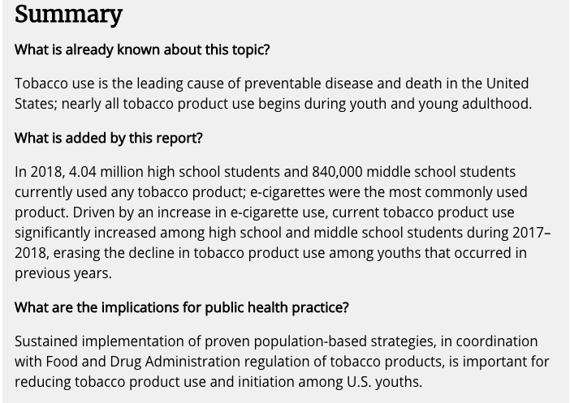
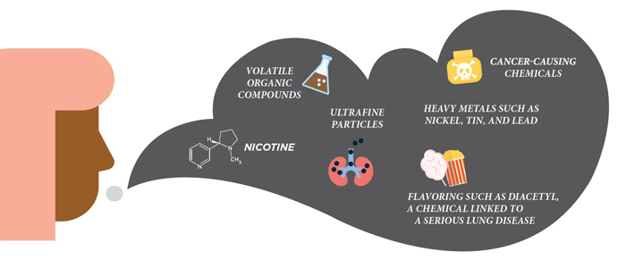
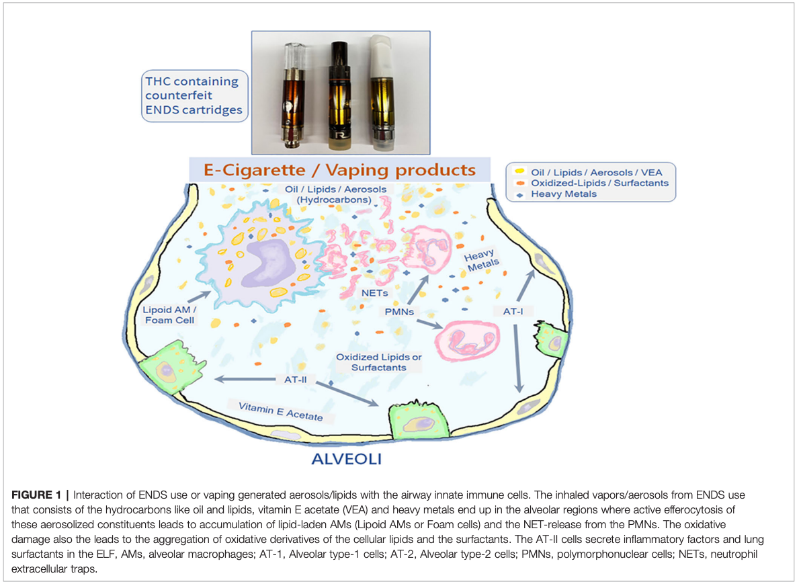
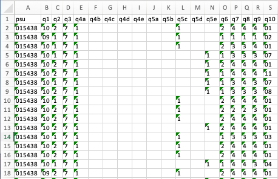
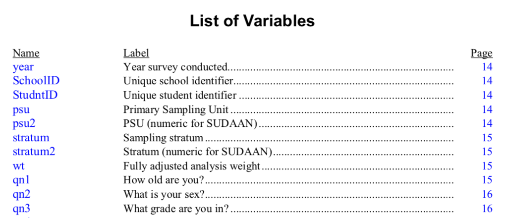
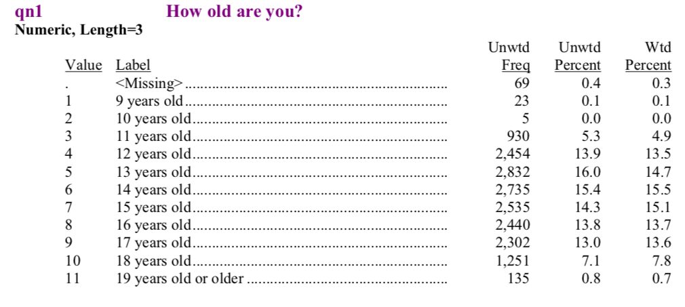

```{r child = "setup.Rmd"}
```

```{r packages, echo=FALSE, message=FALSE, warning=FALSE}
# For nonsese...
library(emo)
library(DT)
library(tidyverse)

knitr::opts_chunk$set(warning=FALSE, message=FALSE) 
```


## Q&A

Q: What is the difference between p and p with a carrot above it in slide 31/34 of Logistic Regression slides?   
A: Good question. Any time you see the carrot above a statistic/parameter, it's referring to the estimated statistic/parameter, as estimated from the data you're working with.

---

## Course Announcements  

- **lab08** due tonight
- **cs02** due  Monday

--

- For cs03 and final project, there will be a form for each individual to fill out about how group work went; this can be used to adjust individual's scores. 

---

class: center, middle

# Background

---
## Previously known before report? 



.small[.footnote[
Source: https://www.cdc.gov/mmwr/volumes/68/wr/mm6806e1.htm?s_cid=mm6806e1_w
]]

---

## What e-cigarette vapors contain...




.small[.footnote[
Source: https://www.cdc.gov/tobacco/basic_information/e-cigarettes/images/e-cigarette-aerosol-can-contain-harmful-ingredients-desktop-700.jpg
]]

---
## Use associated with lung injury



.small[.footnote[
Source: https://www.frontiersin.org/articles/10.3389/fphar.2019.01619/full
]]

---

## Questions

1. How has tobacco and e-cigarette/vaping use by American youths changed since 2015?
2. How does e-cigarette use compare between males and females?
3. What vaping brands and flavors appear to be used the most frequently?
4. Is there a relationship between e-cigarette/vaping use and other tobacco use?

---

## Limitations

.small[
1. The [National Youth Tobacco Survey (NYTS)](https://www.cdc.gov/tobacco/data_statistics/surveys/nyts/index.htm) does not follow the same individual student respondents over time.  A [longitudinal study](https://www.bmj.com/about-bmj/resources-readers/publications/epidemiology-uninitiated/7-longitudinal-studies) that does follow the same individuals over time collects data called [panel data](https://en.wikipedia.org/wiki/Panel_data). The data in this study is called pooled [cross-sectional data](https://en.wikipedia.org/wiki/Cross-sectional_data), and is obtained from random collection of observations across time.

2. The data include percentages of student respondents reporting use of each particular tobacco product, but the survey questions did not ask the relative amount of use of one product compared to another. For example, the survey included questions like: "What flavors of tobacco products have you used in the past 30 days?" but did not ask how often one flavor was used by the same individual over another.

3. While [gender](https://www.genderspectrum.org/quick-links/understanding-gender/) and [sex](https://www.who.int/genomics/gender/en/index1.html) are not actually binary, the data used in this analysis only contain information for groups of individuals who answered the survey questions as male or female. 

]

---

class: center, middle

# The Data

---

## The Data: Source

Data come from the [National Youth Tobacco Survey (NYTS)](https://www.cdc.gov/tobacco/data_statistics/surveys/nyts/index.htm)
- annual survey that asks students in high school and middle school (grades 6-12) about tobacco usage in the United States of America.
- we'll use data from 2015-2019

.small[.footnote[Data available [here](https://www.cdc.gov/tobacco/data_statistics/surveys/nyts/data/index.html)]]

---

## The Data: Format

- One excel spreadsheet for each year
- Corresponding [codebook](http://pbrown.ca/teaching/appliedstats/data/2019-nyts-codebook-p.pdf) (explains what each variable stores)

---

### The Data: Example


---

### Codebook Example: Variables


---

### Codebook Example: Details




---

### Data Import

```{r, eval=FALSE}
# only have to run this once 
# A good time for `eval=FALSE` in code chunk
OCSdata::load_simpler_import("ocs-bp-vaping-case-study", outpath = getwd())
```

.question[`r emo::ji("backhand index pointing right")` **Your Turn**: Load the data into RStudio.]

--

- The data have already been cleaned to only include columns of interest
- will store 5 CSVs in `data/simpler_import`

---

## Data Wrangling

```{r}
# read in CSVs
nyts_data <- list.files("data/simpler_import/", 
                        pattern = "*.csv", 
                        full.names = TRUE) |>
  map(~ read_csv(.))

# get names
nyts_data_names <- list.files("data/simpler_import/",
                              pattern = "*.csv") |>
  str_extract("nyts201[5-9]")

# apply names
names(nyts_data) <- nyts_data_names
```

.question[`r emo::ji("bulb")` **Your Turn**: How are the data stored after this code has executed?]

---

## Data Exploration

.scrollable[
```{r}
glimpse(nyts_data)
```
]

---

## Data Cleaning (Variable Names)

.panelset[
.panel[.panel-name[2015]
```{r}
# 2015
nyts_data[["nyts2015"]] <- nyts_data[["nyts2015"]] |>
  rename(Age = Qn1,
         Sex = Qn2,
         Grade = Qn3)
```
]
.panel[.panel-name[Function]
```{r}
update_survey <- function(dataset) { 
  dataset |>
    rename(Age = Q1,
           Sex = Q2,
           Grade = Q3,
           menthol = Q50A,
           clove_spice = Q50B,
           fruit = Q50C,
           chocolate = Q50D,
           alcoholic_drink = Q50E,
           candy_dessert_sweets = Q50F,
           other = Q50G)
}
```
]
.panel[.panel-name[2016-2018]
```{r}
nyts_data <- nyts_data |> 
  map_at(vars(-nyts2015, -nyts2019), update_survey)
```

.question[`r emo::ji("bulb")` **Your Turn**: Why are we only applying this function for three of the years?]

]
.panel[.panel-name[2019]
```{r}
nyts_data[["nyts2019"]] <- nyts_data[["nyts2019"]] |>
  rename(brand_ecig = Q40,
         Age = Q1,
         Sex = Q2,
         Grade = Q3,
         menthol = Q62A,
         clove_spice = Q62B,
         fruit = Q62C,
         chocolate = Q62D,
         alcoholic_drink = Q62E,
         candy_dessert_sweets = Q62F,
         other = Q62G)
```
]
.panel[.panel-name[Check]
```{r}
# check-in
map(nyts_data, names)
```
]]

---

## Data Cleaning (Variable Values)
Values correspond to a *category* 
- `Age` Value 1 == 9 years old
- `Grade` Value 1 == 6th grade)

---
## Data Cleaning (Variable Values)

.panelset[
.panel[.panel-name[Function]
.small[
.scrollable[
```{r}
update_values <- function(dataset){
  dataset |>
    mutate(Age = as.numeric(Age) + 8,
           Grade = as.numeric(Grade) + 5) |>
    mutate(Age = as.factor(Age),
           Grade = as.factor(Grade),
           Sex = as.factor(Sex)) |>
    mutate(Sex = recode(Sex,
                        `1` = "male",
                        `2` = "female")) |>
    mutate_all(~ replace(., . %in% c("*", "**"), NA)) |>
    mutate(Age = recode(Age, `19` = ">18"),
           Grade = recode(Grade,
                          `13` = "Ungraded/Other")) |>
    mutate_at(vars(starts_with("E", ignore.case = FALSE),
                   starts_with("C", ignore.case = FALSE)
    ), list( ~ recode(., `1` = TRUE,
                      `2` = FALSE,
                      .default = NA,
                      .missing = NA)))
}
```
]

.question[`r emo::ji("bulb")` **Your Turn**: Explain what at least *one* function in here is doing?]
]]
.panel[.panel-name[Apply]
```{r}
nyts_data <- map(nyts_data, update_values)

# function to count how many males
count_sex <- function(dataset){dataset |> 
    filter(Sex=='male') |> 
    count(Sex) |> 
    pull(n)}
```
]
.panel[.panel-name[Check]

.small[

According to the codebook, we should have:  

1) 8,958 males in 2015  
2) 10,438 males in 2016  
3) 8,881 males in 2017  
4) 10,069 males in 2018  
5) 9,803 males in 2019   ]

.scrollable[
```{r}
# count how many males are in our dataset
map(nyts_data, count_sex)
```
]]]

---

### Flavor Data (2016-2019)

.small[
- setting missing values to FALSE, then... 
- the TRUE values will represent those who reported using a specific flavor out of all users (rather than those that used a specific flavor compared to those who used a different flavor.)
]
```{r}
update_flavors <- function(dataset){
  dataset |>
    mutate_at(vars(menthol:other),
              list(~ recode(.,
                            `1` = TRUE,
                            .default = FALSE,
                            .missing = FALSE))) }

nyts_data  <- nyts_data  |> 
  map_at(vars(-nyts2015), update_flavors)
```

---

### 2019-specific changes

- some of the 2019 questions use the values “.N”, “.S”, and “.Z” to indicate different types of missing data -> turn into `NA`s
```{r}
nyts_data[["nyts2019"]] <- nyts_data[["nyts2019"]] |>
  mutate_all(~ replace(., . %in% c(".N", ".S", ".Z"), NA)) |>
  mutate(psu = as.character(psu)) |>
  mutate(brand_ecig = recode(brand_ecig,
                             `1` = "Other", # levels 1,8 combined to `Other`
                             `2` = "Blu",
                             `3` = "JUUL",
                             `4` = "Logic",
                             `5` = "MarkTen",
                             `6` = "NJOY",
                             `7` = "Vuse",
                             `8` = "Other"))
```

---

## Combine the data!

```{r}
nyts_data <- nyts_data |>
  map_df(bind_rows, .id = "year") |>
  mutate(year = as.numeric(str_remove(year, "nyts"))) # clean-up year column
```

.question[`r emo::ji("question")` **Your Turn**: What does this code do?]

---

## The Data

.scrollable[
```{r}
glimpse(nyts_data)
```
]

---

## Current vs. ever users

We define these two groups as follows:

1) **current** = students who used a product for >=1 day in the past 30 days  
2) **ever** =  students who report having used or tried a product at any point in time

All **current** users are therefore **ever** users but not all **ever** users are **current** users. Thus, **current** users are a subset of **ever** users.

---

### What this looks like in the data..

 - `EPIPE`: Students who reported they have smoked tobacco from a pipe (not hookah).  
 - `CPIPE`: Students who reported they smoked tobacco in a pipe (not hookah) during the past 30 days. 
 - `EROLLCIGTS`: Students who reported they have tried smoking roll-your-own cigarettes. 
 - `CROLLCIGTS`: Students who reported they smoked roll-your-own cigarettes during the past 30 days. 
 
---

### Clean up columns: tobacco

```{r}
nyts_data <- nyts_data %>%
  mutate(tobacco_sum_ever = rowSums(select(., starts_with("E", 
                                    ignore.case = FALSE)), na.rm = TRUE),
         tobacco_sum_current = rowSums(select(., starts_with("C", 
                                    ignore.case = FALSE)), na.rm = TRUE))  |>
  mutate(tobacco_ever = case_when(tobacco_sum_ever > 0 ~ TRUE,
                                  tobacco_sum_ever == 0 ~ FALSE),
         tobacco_current = case_when(tobacco_sum_current > 0 ~ TRUE,
                                     tobacco_sum_current == 0 ~ FALSE))
```

.question[`r emo::ji("question")` **Your Turn**: What does this code do?]
 
---

### Clean up columns: e-cig/vaping vs others

.small[
```{r}
nyts_data <- nyts_data %>% 
  mutate(ecig_sum_ever = rowSums(select(., EELCIGT), na.rm = TRUE),
         ecig_sum_current = rowSums(select(., CELCIGT), na.rm = TRUE),
         non_ecig_sum_ever = rowSums(select(., starts_with("E",  ignore.case = FALSE), 
                                            -EELCIGT), na.rm = TRUE),
         non_ecig_sum_current = rowSums(select(., starts_with("C", ignore.case = FALSE), 
                                               -CELCIGT), na.rm = TRUE)) |>
  mutate(ecig_ever = case_when(ecig_sum_ever > 0 ~ TRUE,
                              ecig_sum_ever == 0 ~ FALSE),
         ecig_current = case_when(ecig_sum_current > 0 ~ TRUE,
                                  ecig_sum_current == 0 ~ FALSE),
         non_ecig_ever = case_when(non_ecig_sum_ever > 0 ~ TRUE,
                                   non_ecig_sum_ever == 0 ~ FALSE),
         non_ecig_current = case_when(non_ecig_sum_current > 0 ~ TRUE,
                                      non_ecig_sum_current == 0 ~ FALSE))
```
]

---

## Specify use group

.scrollable[
```{r}
nyts_data <- nyts_data |>
             mutate(ecig_only_ever = case_when(ecig_ever == TRUE &
                                           non_ecig_ever == FALSE &
                                            ecig_current == FALSE &
                                        non_ecig_current == FALSE ~ TRUE,
                                                             TRUE ~ FALSE),
              ecig_only_current = case_when(ecig_current == TRUE &
                                           non_ecig_ever == FALSE &
                                        non_ecig_current == FALSE ~ TRUE,
                                                            TRUE ~ FALSE),
            non_ecig_only_ever = case_when(non_ecig_ever == TRUE &
                                               ecig_ever == FALSE &
                                            ecig_current == FALSE &
                                        non_ecig_current == FALSE ~ TRUE,
                                                            TRUE ~ FALSE),
      non_ecig_only_current = case_when(non_ecig_current == TRUE &
                                               ecig_ever == FALSE &
                                            ecig_current == FALSE ~ TRUE,
                                                            TRUE ~ FALSE),
                        no_use = case_when(non_ecig_ever == FALSE &
                                               ecig_ever == FALSE &
                                            ecig_current == FALSE &
                                        non_ecig_current == FALSE ~ TRUE,
                                                            TRUE ~ FALSE)) %>%
                 mutate(Group = case_when(ecig_only_ever == TRUE |
                                       ecig_only_current == TRUE ~ "Only e-cigarettes",
                                      non_ecig_only_ever == TRUE |
                                   non_ecig_only_current == TRUE ~ "Only other products",
                                                  no_use == TRUE ~ "Neither",
                                          ecig_only_ever == FALSE &
                                       ecig_only_current == FALSE &
                                      non_ecig_only_ever == FALSE &
                                   non_ecig_only_current == FALSE &
                                                  no_use == FALSE ~ "Combination of products"))
```
]
---

# Total number of students surveyed each year

```{r}
nyts_data <- nyts_data |> 
  add_count(year)
```

---

## The Data!

.scrollable[
```{r}
glimpse(nyts_data)
```
]
---

## Save the Data

```{r, eval=FALSE}
save(nyts_data, file="data/wrangled/wrangled_data_vaping.rda")
```


