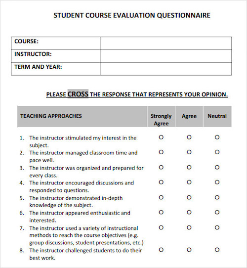

```{r setup, include=FALSE}
# R options
options(
  htmltools.dir.version = FALSE, # for blogdown
  show.signif.stars = FALSE,     # for regression output
  warm = 1
  )
# Set dpi and height for images
library(knitr)
opts_chunk$set(fig.height = 2.35, dpi = 300) 
# ggplot2 color palette with gray
color_palette <- list(gray = "#999999", 
                      salmon = "#E69F00", 
                      lightblue = "#56B4E9", 
                      green = "#009E73", 
                      yellow = "#F0E442", 
                      darkblue = "#0072B2", 
                      red = "#D55E00", 
                      purple = "#CC79A7")
# For nonsese...
library(emo)
htmltools::tagList(rmarkdown::html_dependency_font_awesome())
```

```{r echo=FALSE, message=FALSE, warning=FALSE}
library(tidyverse)
library(rvest)
```

## Agenda

1. Lab 04: Modelling course evaluations
2. Getting started with lab

---

## Lab 06: Modelling course evaluations

- Many college courses give students the opportunity to evaluate the course and the instructor anonymously

- The use of these student evaluations as an indicator of course quality and teaching effectiveness is often criticized because these measures may reflect the influence of non-teaching related characteristics, e.g. the physical appearance of the instructor

---

## You've all seen something like this...



---

## and then there's also this


---

## Data comes from...

"Beauty in the classroom: instructors’ pulchritude and putative pedagogical productivity" 

Daniel S. Hamermesh, Amy Parker, Beauty in the classroom: instructors pulchritude and putative pedagogical productivity, Economics of Education Review, Volume 24, Issue 4, August 2005. http://www.sciencedirect.com/science/article/pii/S0272775704001165

---

## Some new challenges in this lab

- Dataset is not in your repo, you will need to download it to your computer first and upload it into the appropriate folder in your project (link in the Data section of lab instructions)

- There isn't much code on the lab instructions, you might need to refer to course slides to put the pieces together, however most of the time 
    + you'll be visualizing with `ggplot`, 
    + fitting a model with `lm`, 
    + and viewing some model statistics with `glance`


