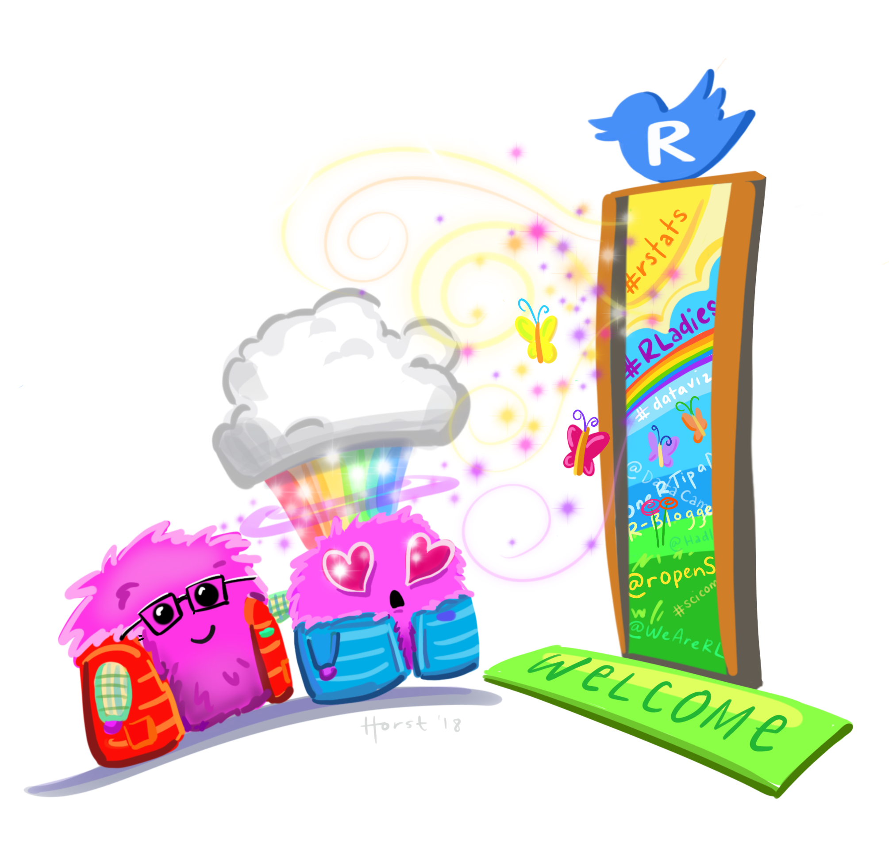

```{r setup, include=FALSE}
# R options
options(
  htmltools.dir.version = FALSE, # for blogdown
  show.signif.stars = FALSE,     # for regression output
  warm = 1
  )
# Set dpi and height for images
library(knitr)
opts_chunk$set(fig.height = 2.65, dpi = 300) 
# ggplot2 color palette with gray
color_palette <- list(gray = "#999999", 
                      salmon = "#E69F00", 
                      lightblue = "#56B4E9", 
                      green = "#009E73", 
                      yellow = "#F0E442", 
                      darkblue = "#0072B2", 
                      red = "#D55E00", 
                      purple = "#CC79A7")
# For nonsese...
library(emo)
htmltools::tagList(rmarkdown::html_dependency_font_awesome())
```

```{r echo=FALSE, message=FALSE, warning=FALSE}
library(tidyverse)
library(googlesheets4)
```

class: center, middle

# Welcome to COGS 137!

Practical Data Science in R

---

## What is R?

<i class="fa fa-code fa"></i> : R is a statistical programming language. 


While R has most/all of the functionality of **YFPL** (your favorite programming language), it was designed for the specific use of analyzing data.

--

## What is data science?

<i class="fa fa-laptop fa-lg"></i>: Data science is the scientific process of using data to answer interesting questions and/or solve important problems.

---

## Practical Data Science in R

- Program at the introductory level in the R statistical programming language

--

- Employ the tidyverse suite of packages to interact with, wrangle, visualize, and model data

--

- Explain & apply statistical concepts (estimation, linear regression, logistic regression, etc.) for data analysis

--

- Communicate data science projects through effective visualization, oral presentation, and written reports

---

## Who am I?

Shannon Ellis

<i class="fa fa-envelope"></i> &nbsp; [sellis@ucsd.edu](mailto:sellis@ucsd.edu) <br>
<i class="fa fa-home"></i> &nbsp; [shanellis.com](http://www.shanellis.com/) <br>
<i class="fa fa-university"></i> &nbsp; MANDE B-150 <br>
<i class="fa fa-calendar"></i> &nbsp; MWF 9-9:50AM (Lab: Fri 10-10:50)


---

## Who all is involved?

.pull-left[

[Prof Ellis](http://www.shanellis.com/) 
 
<i class="fa fa-university"></i> &nbsp; Mandeville Courtyard <br>
<i class="fa fa-calendar"></i> &nbsp; OH Mon 10AM-12PM
<br><br>

[Sean Trott](https://seantrott.github.io/) (TA)
 
<i class="fa fa-university"></i> &nbsp; [TBD]() <br>
<i class="fa fa-calendar"></i> &nbsp; TBD
<br><br>


]

.pull-right[

Shubham Kulkarni (IA)

<i class="fa fa-university"></i> &nbsp; [TBD]() <br>
<i class="fa fa-calendar"></i> &nbsp; TBD
<br><br>

Colin Wang (IA)

<i class="fa fa-university"></i> &nbsp; CSE Basement <br>
<i class="fa fa-calendar"></i> &nbsp; OH Mon 4-5 PM
<br><br>
]

---

# What is this course?

Everything you want to know about the course, and everything you will need for the course will be posted at: [https://cogs137.github.io/website/](https://cogs137.github.io/website/)

--

- Is this an intro CS course? No.

--

- Will we be doing computing? Yes.

--

- What computing language will we learn? R.

--

- Is this an intro stats course? No.

--

- Will we be doing stats? Yes.

--

- Are there any prerequisites? Yes, an intro statistics course!


---

## So...I don't have to know how to program already?

.pull-left[


.footnote[Artwork by [@allison_horst](https://github.com/allisonhorst/stats-illustrations/) <a href="https://twitter.com/allison_horst" title="allison_horst"><i class="fa fa-twitter"></i></a>]

]

.pull-right[

Nope! The first few weeks of the course will be all about getting **comfortable using the R programming language**!
{{content}}

]

--

After that, we'll focus on delving into interesting statistical analyses through **case studies**.
{{content}}

---

# The General Plan

- Weeks 1-4: Learn to program in the tidyverse in R

--

- Weeks 5-10: Data Analysis, Statistics, & Case Studies

--

  - CS1: Youth Connection
  - CS2: Right to Carry
  - CS3: Vaping Behaviors


---

class: center, middle

# Housekeeping

---

# In-person, synchronous learning

1. I will be teaching (so long as I’m healthy) live and in person.
1. Lectures will be podcast.
1. Attendance will be neither required nor incentivized.
1. If you’re not feeling well, please stay home. I will do the same.
1. Exam will be take-home.

--

**I am committed to offering in-person learning this quarter.** However, I am also aware of circumstances surrounding many students, making it difficult or impossible for them to learn in-person. The course will work for all.

---

# The (dreaded) waitlist

- New courses are capped at 50 students
- I don't control the waitlist (cogsadvising@ucsd.edu does)
- I don't anticipate our staff enrolling anyone from the waitlist...unless currently-enrolled students drop the course.

---

# Lab & Office Hours

- Lab will start Fri of week 1

--

- I will hang out after class today for questions/concerns from students

--

- All office hours begin Mon of week 1

---

# Course Materials

- Textbooks are free and available online

--

- Course platforms:
  - Website : schedule, policies, due dates, etc.
  - GitHub : retrieving assignments, labs, exams, etc.
  - datahub : completing assignments, labs, exams etc.
  - Gradescope : submitting assignments
  - Canvas : grades, course-specific links
  - Campuswire : Q&A

---

# A new course!

- Y'all, I'm developing as we go

--

- If something doesn't make sense, tell me!
- If you've got feedback/suggestions, I'm all ears!


---

class: center, middle

# Course structure and policies

---

## Class meetings

- Interactive

- Lectures & lots of learn-by-doing

- Bring your laptop to class every day

---

## Diversity & Inclusiveness:

.ocean[Goal]: every student be well-served by this course

--

.ocean[Philosophy]: The diversity of students in this class is a huge asset to our learning community; our differences provide opportunities for learning and understanding. 

--

.ocean[Plan]: Present course materials that are conscious of and respectful to diversity (gender identity, sexuality, disability, age, socioeconomic status, ethnicity, race, nationality, religion, politics, and culture)

--

.ocean[But]: if I ever fall short or if you ever have suggestions for improvement, please do share with me! There is also an [anonymous Google Form](https://goo.gl/forms/2nXnDNbgYuS1OsGF2) if you're more comfortable there.

---

## How to get help

- Lab
- Office Hours
- Campuswire

--
  - A few guidelines:
    1. No duplicates.
    2. Public posts are best.
    3. Posts should include your question, what you've tried so far, and resources used.
    4. Helping others is encouraged.
    5. No assignment code in public posts.
    6. We're not robots.
---

##  The R Community


.footnote[Artwork by [@allison_horst](https://github.com/allisonhorst/stats-illustrations/) <a href="https://twitter.com/allison_horst" title="allison_horst"><i class="fa fa-twitter"></i></a>]

---

## Academic integrity

Don't cheat.

--

Teamwork is allowed, but you should be able to answer "Yes" to each of the following: 
- Can I explain each piece of code and each analysis carried out in what I'm submitting? 
- Could I reproduce this code/analysis on my own?

--

The Internet is a great resource.
- Cite your sources.

--

Teamwork is *not* allowed on your midterm.
- It is open-notes and open-Google
- You cannot discuss the questions on the exam with anyone.


---

## Course components:

- .calm[Labs] (9): Individual submission; graded on effort

--

- .calm[Homework] (5): Individual submission; graded on correctness

--

- .calm[Exam] (1): Individual completion & submission, take-home midterm

--

- .calm[Case Study Projects] (3): Team submission, technical analysis report

--

- .calm[Final Project] (1): Team submission, due Mon of finals week

---

## Grading

Your final grade will be comprised of the following:

Assignment (#) | % of grade |
----------------------|----------------
Labs  (9)             | 18%
Homework (5)          | 30%
Midterm (1)           | 14%
Case Study Projects* (3)      | 24%
Final project* (1)    | 14%

\* indicates group submission


---

## Late/missed work policy

- Homework and case study projects: accepted up to 3 days (72 hours) after the assigned deadline for a 25% deduction

- No late deadlines for labs, the exam, or the final project

--

- Note: Prof Ellis is a reasonable person; reach out to her if you have an extenuating circumstance at any point in the quarter. 

---

## Who's in this class? 

```{r data, message=FALSE, warning=FALSE}
roster <- read_sheet('1fjfok3lBHhfUnXyfyyo2yrG7lFwYTO8Wx2sf1dolR9o')

ggplot(roster, aes(x = College)) +
  geom_bar() +
  labs(title = "COGS 137") +
  theme_bw(base_size = 14) + 
  theme(plot.title.position = "plot")
```

.footnote[This code will not run for you because you don't have access to the roster for this course.]
---

## Who's in this class? 


```{r major}
roster %>%
  mutate(major = substr(Major, 1, 2)) %>%
  ggplot(aes(fct_infreq(major))) + geom_bar() +
  labs(title = "COGS 137",
       x = "Major") +
  theme_bw(base_size = 12) + 
  theme(plot.title.position = "plot")
```

---

## Who's in this class? 

```{r year}
roster %>%
  ggplot(aes(fct_relevel(Level, "JR", "SR"))) +
  geom_bar() +
  labs(title = "COGS 137",
       x = "Level") +
  theme_bw(base_size = 14) + 
  theme(plot.title.position = "plot")
```

---

## I'd like to know more!

(optional) [Student Survey](https://docs.google.com/forms/d/e/1FAIpQLSe9GjElWRxmhiIhpm1DkI--J6YE0ftFpxTj17kckp_EY9I7Bw/viewform?usp=sf_link) 
- complete by Monday at 11:59 PM for small amount of extra credit

--

(optional) [Daily Post-Lecture Feedback](https://docs.google.com/forms/d/e/1FAIpQLSc6HgSdT3QSn1DRuEn_Su8txurosjQA_K3kO2vUwsn2Nmf_SA/viewform?usp=sf_link)
- opportunity to reflect on learning
- opportunity to ask questions (I will read and answer these)


.footnote[links to both surveys are also on Canvas]
