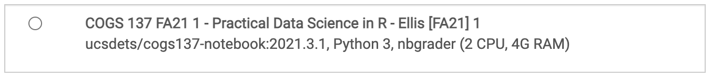
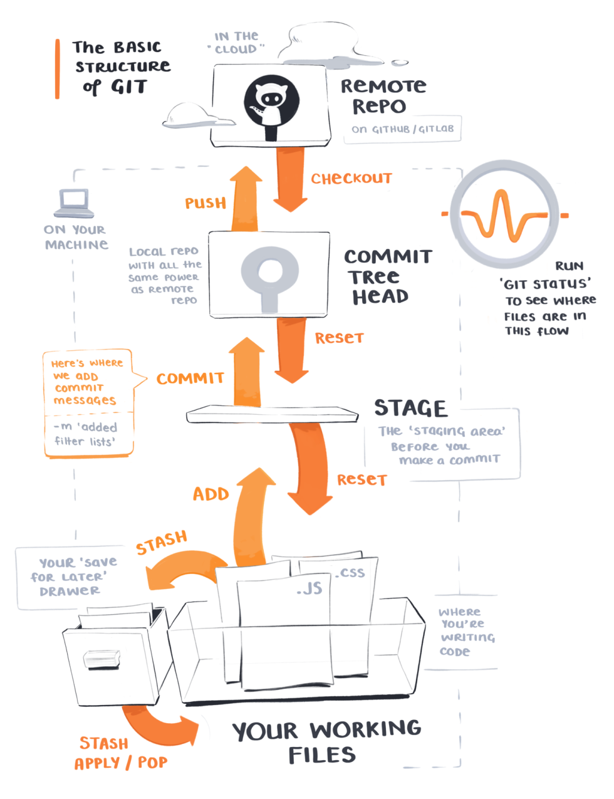

```{r setup, include=FALSE}
# R options
options(
  htmltools.dir.version = FALSE, # for blogdown
  show.signif.stars = FALSE,     # for regression output
  warm = 1
  )
# Set dpi and height for images
library(knitr)
opts_chunk$set(fig.height = 2.65, dpi = 300) 
# ggplot2 color palette with gray
color_palette <- list(gray = "#999999", 
                      salmon = "#E69F00", 
                      lightblue = "#56B4E9", 
                      green = "#009E73", 
                      yellow = "#F0E442", 
                      darkblue = "#0072B2", 
                      red = "#D55E00", 
                      purple = "#CC79A7")
# For nonsese...
library(emo)
htmltools::tagList(rmarkdown::html_dependency_font_awesome())
```

```{r echo=FALSE, message=FALSE, warning=FALSE}
library(tidyverse)
```
## Q&A

.small[Q: What will the lab classes on Friday’s entail?  
A: There will be an introduction and short review each week and then an RMarkdown notebook for you to complete. This will give you more hands-on practice with course concepts.

Q: Is R limited relative to other programming languages?...I was wondering if one could develop software or data structures using R.
A: A generally true statement is that anything you can do in another programming language, you can also do in R. Now, it may be different or less straightforward, but there's lots of software development in R!

Q: How much coding experience do I need to have coming into this class?  
A: None! Of course if you have some, you may pick concepts up more quickly...but there is no programming prerequisite.

Q: I'm curious if we need other packages to complete our assignments? I know we require tidyverse but if there's any other package that we may need?  
A: We'll primarily use the tidyverse, but there will be other packages. On assignments, you'll always be informed which to use. Most that we'll use have already been installed on datahub for you.

Q: Ah! Project groups!  
A: Don't worry about these yet! There will be time to form these later. I'll let y'all know when.]
---

## Course Announcements

**Due Dates**:
- Complete **pre-course survey** by tonight (11:59 PM)
- **Lab 01** now available (due Friday 11:59 PM)
- **HW 01** now available (due Monday 10/4 11:59 PM)

**Notes**:
- The first lab has *a lot* more text than subsequent labs. And the first hw is shorter and simpler than subsequent homework assignments. We want you to gain comfort with the course platforms and how things work before adding more content.
- Prof Ellis' OH today 10-noon; location: courtyard right outside of the classroom
---

class: center, middle

# Tooling

---

## Agenda
- datahub
- R and RStudio
- RStudio Projects
- R Markdown files
- Git and GitHub
- Recap

---

## Datahub

Datahub is a platform hosted by UCSD that gives students access to computational resources.

This means that while you'll be typing on your keyboard, you'll be *using* UCSD's computers in this class.

Website: https://datahub.ucsd.edu/

--

**Launch Environment**

When working on "stuff" for this course, select the COGS 137 environment.




---

## Toolkit


- Scriptability $\rightarrow$ R

- Literate programming (code, narrative, output in one place) $\rightarrow$ R Markdown

- Version control $\rightarrow$ Git / GitHub

---

class: center, middle

# R and RStudio

---

## What is R/RStudio?

- R is a statistical programming language

- RStudio is a convenient interface for R (an integreated development environment, IDE)

---

## Let's take a tour - R / RStudio

<center>
[DEMO]
</center>

--

Concepts introduced:

- Console

- Using R as a calculator

- Environment

- Loading and viewing a data frame

- Accessing a variable in a data frame

- R functions

---

## Your Turn

1. Login to datahub
2. Carry out a mathematical operation in the console
3. View the `diamonds` dataframe
4. Access a column from the `diamonds` dataframe
5. Calculate the median for one of the numeric columns

.whisper[Put a green sticky on the front of your computer when you're done. Put a pink if you want help/have a question.]

---
## R packages

- **Packages** are the fundamental units of reproducible R code. They include reusable R functions, the documentation that describes how to use them, and sample data<sup>1</sup>

- As of September 2021, there are over 16,000 R packages available on **CRAN** (the Comprehensive R Archive Network)<sup>2</sup>

- We're going to work with a small (but important) subset of these!

.footnote[
<sup>1</sup> Wickham and Bryan, [R Packages](https://r-pkgs.org/).

<sup>2</sup> [CRAN contributed packages](https://cran.r-project.org/web/packages/).

]
---

## What is the Tidyverse?

.pull-left[

]

.pull-right[
<center>
<a href="https://www.tidyverse.org/">tidyverse.org</a>
</center>

- The tidyverse is an opinionated collection of R packages designed for data science. 
- All packages share an underlying philosophy and a common syntax. 
]

---

## RStudio Projects<sup>1</sup> 

- Built-in functionality to keep all files for a single project organized

.footnote[
  <sup>1</sup> [RStudio Projects Documentation]( https://support.rstudio.com/hc/en-us/articles/200526207-Using-Projects)
]


---

class: center, middle

# R Markdown

---

## R Markdown

- Fully reproducible reports -- each time you knit the analysis is ran from the beginning

- Simple markdown syntax for text

- Code goes in chunks, defined by three backticks, narrative goes outside of chunks

---

## Let's take a tour -- R Markdown

<center>
[DEMO]
</center>

Before we move on...

.question[<i class="fa fa-user" aria-hidden="true"></i> &nbsp; What is the Bechdel test?]

--

The Bechdel test asks whether a work of fiction features at least two women who talk to each other about something other than a man, and there must be two women named characters.

--

Concepts introduced:

- Knitting documents

- R Markdown and (some) R syntax

---

## R Markdown tips

- Keep the [R Markdown cheat sheet](https://github.com/rstudio/cheatsheets/raw/master/rmarkdown-2.0.pdf) and Markdown Quick Reference (Help -> Markdown Quick Reference) handy, we'll refer to it often as the course progresses

- The workspace of your R Markdown document is separate from the Console

<br><br>
<center>
[DEMO]
</center>

---

## How will we use R Markdown?

- Every lab / project / homework / notes / etc. is an R Markdown document

- You'll always have a template R Markdown document to start with

- The amount of scaffolding in the template will decrease over the semester

---

class: center, middle

# Git and GitHub

---

## How do we collaborate?

- The statistical programming language we'll use is R

- The software we use to interface with R is RStudio

- But how do I get you the course materials that you can build on for your assignments?
    + Hint: I'm not going to email you documents, that would be a mess!
  
---

## Version control

- We introduced GitHub as a platform for collaboration

- But it's much more than that...

- It's actually desiged for version control

---

## Versioning


---

## Versioning

with human readable messages


---

## Why do we need version control?


---

# Git and GitHub tips

- Git is a version control system -- like “Track Changes” features from Microsoft Word on steroids. GitHub is the home for your Git-based projects on the internet -- like DropBox but much, much better).

--

- There are millions of git commands -- ok, that's an exaggeration, but there are a lot of them -- and very few people know them all. 99% of the time you will use git to add, commit, push, and pull.

--

- We will be doing Git things and interfacing with GitHub through RStudio, but if you google for help you might come across methods for doing these things in the command line -- skip that and move on to the next resource unless you feel comfortable trying it out.

.footnote[[happygitwithr.com](http://happygitwithr.com/): book for working with git in R; Some content is beyond the scope of this course, but it's a good resource]

---

## Let's take a tour -- Git / GitHub

**We'll cover this time permitting, you'll see it again in lab this week**

Concepts introduced:

- Connect an R project to Github repository

- Working with a local and remote repository

- Committing, Pushing and Pulling

There is just a bit more of GitHub that we'll use in this class, but for today this is enough.

---
## Git: Review

.right-column[]

.footnote[Source: [Maggie Appleton](https://maggieappleton.com/git-mistakes)]


## Your Turn

1. Navigate to the demo01 URL (on Canvas)
2. Accept the "assignment" (this is NOT graded)
3. Clone the repo 
4. Edit the document 
5. Knit the document
6. Push your changes

.whisper[Put a green sticky on the front of your computer when you're done. Put a pink if you want help/have a question.]


---
class: center, middle

# Recap

---

## Recap

Can you answer these questions?

- What is R vs RStudio?
- What are RStudio Projects
- What are the components of an R Markdown file?
- What is version control, and why do we care?
- What is git vs GitHub (and do I need to care)?

---

## Additional `git` Resources

#### Version Control (git and GitHub):
- [Getting Started with git](https://docs.github.com/en/free-pro-team@latest/github/getting-started-with-github)
- [GitHub Guide](https://guides.github.com/activities/hello-world/)
- [GitHub Desktop App Tutorial](https://github.com/jlord/git-it-electron)
- [Git Command Line Resource](https://rogerdudler.github.io/git-guide/)
-  Using `git` from the command line
	- [Installing and using `git` (Part 1)](https://www.youtube.com/watch?v=ng4X6qF8XVY), by COGS 108 TA Ganesh (youtube, 22min tutorial)
	- [merge conflicts and branching (Part 2)](https://youtu.be/Nk1gtrbTZ2Y), by IA Shubham Kulkarni (youtube, 8min tutorial)
- [Using `git` with GitHub Desktop](https://youtu.be/zQc5vQEBips), by COGS 108 TA Sidharth Suresh (youtube, 13min tutorial)
- [GIT & GITHUB TUTORIAL](https://www.youtube.com/watch?v=xuB1Id2Wxak), from edureka!
	- with [notes](https://docs.google.com/document/d/1GAdkvn7lWzeLekvC343WNZC2rZGhQOfPOU2dMha9aws/edit) from COGS 18/108 TA Holly(Yueying) Dong
