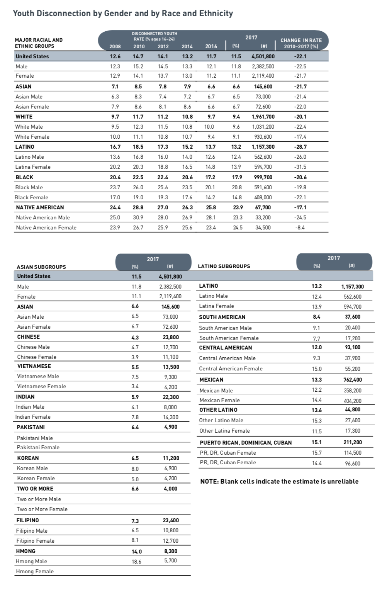
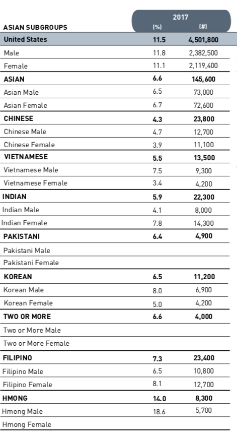
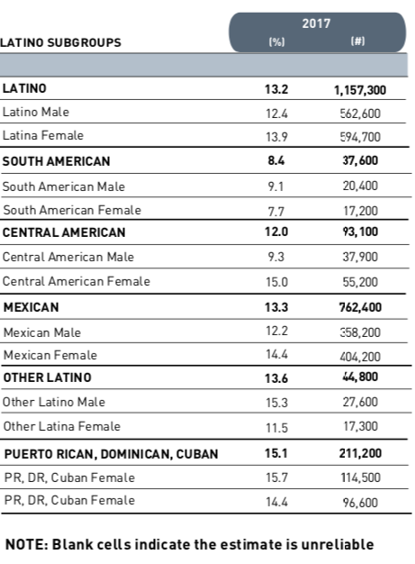
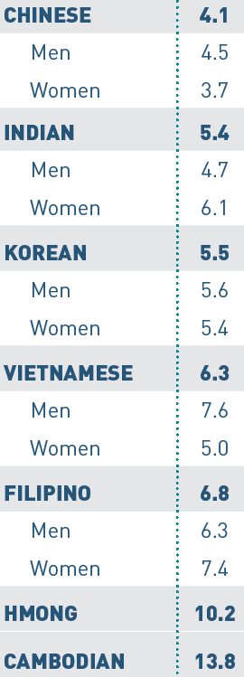

```{r packages, echo=FALSE, message=FALSE, warning=FALSE}
library(tidyverse)

# For nonsese...
library(emo)
library(DT)
```

## Q&A

Q: I think learning about new functions/ways to find the data we want. For example, residuals, log(price), regression line, I might have missed this but  what is "set_engine". Basically what ways can we approach the data.  I'm assuming we will eventually get there  
A: Yes! We will be working on this a lot in coming weeks! But, to specifically answer what `set_engine()` is. This is a function from the `parsnip` package that allows you to 1) specify the computational approach you want to use for modelling (so far, we've only used "lm") and 2) allows you to specify the arguments you want that model to use during modelling (we'll get there).

---
## Course Announcements

- hw02 due tonight (11:59 PM) 
  - submission by pushing to GitHub (NO gradescope submission)
- exam01 scores have been posted
- exam01 and lab04 answer keys have been posted

--

**Case Study**
- details for case study report to be posted/discussed Wednesday
- must be in a group by Friday
- should be following along with code in lecture/trying it out/understanding it

---

class: center, middle

# Background

---

## Disparities in Youth Disconnection<sup>1</sup>

.ocean[disconnected youth] - young people between the ages of 16 and 24 who are neither working nor in school<sup>2</sup>

--

.ocean[claim] - "people who experience a period of disconnection as young adults go on to earn less and are less likely to be employed, own a home, or report good health by the time they reach their thirties”

--

.footnote[
<sup>1</sup>Case Study Reference: Wright, Carrie and Ontiveros, Michael and Jager, Leah and Taub, Margaret and Hicks, Stephanie C. (2020). https://github.com/opencasestudies/ocs-youth-disconnection-case-study. Disparities in Youth Disconnection.
]
.footnote[
<sup>2</sup> https://measureofamerica.org/
]
---

### Known Risk Factors

There are many known risk factors, which have been identified in a variety of contexts (from family, friends, school, community, society) including:

.small[
- poverty (disconnected youth are nearly twice as likely to live in poverty and receive Medicaid)
- racial/ethnic disparities (findings suggest that these persist even when controlling for income)
- residential environment (in 2016 while 11.7% was the national average, 24% of people age 16-24 in the rural South were disconnected)
- poor academic performance
- poor mental health
- substance use disorders
- parental unemployment
- trauma exposure
- association with socially deviant peers
- school policies such as “one strike and you’re out” - which is a zero tolerance school expulsion policy and shown to increase dropouts and incarceration rates
]

---

### Known Risk Factors (cont'd)

These risk factors make it more likely for young people to miss out on education, training, and networking that can act as a foundation for a successful career.

---

### Known Consequences

- chronic unemployment
- poverty
- poor mental health and poor general health (in a 2002 study - youths disconnected for 6 or more months were 3 times more likely to develop depression or other mental health disorder)
- criminal behavior (in a 2002 study - youths disconnected for 6 or more months were 5 times more likely to have a criminal record)
- incarceration
- early mortality

---

class: center, middle

# Questions

---

## Questions

1. How have youth disconnection rates in American youth changed since 2008?
2. In particular, how has this changed for different gender and ethnic groups? Are any groups particularly disconnected?

---

class: center, middle

# The Data

---

## The Data: Source<sup>1</sup>

.small[
1. Lewis, Kristen. [Making the Connection: Transportation and Youth Disconnection](https://ssrc-static.s3.amazonaws.com/moa/Making%20the%20Connection.pdf). New York: Measure of America, Social Science Research Council, 2019. (Data up to 2017)

2. Lewis, Kristen. [A Decade Undone: Youth Disconnection in the Age of Coronavirus.](https://ssrc-static.s3.amazonaws.com/moa/ADecadeUndone.pdf) New York: Measure of America, Social Science Research Council, 2020. (Data up to 2018)
]

--

.ocean[American Community Survey (ASC)] - largest survey conducted by the US Census Bureau; started in 2005; collects data for 3.5 million households annually. Data collected: ancestry, citizenship, income, employment, disability, etc.

.footnote[<sup>1</sup>Mendelson, T., Mmari, K., Blum, R. W., Catalano, R. F. & Brindis, C. D. Opportunity Youth: Insights and Opportunities for a Public Health Approach to Reengage Disconnected Teenagers and Young Adults. Public Health Rep 133, 54S-64S (2018). https://www.ncbi.nlm.nih.gov/pmc/articles/PMC6243446/.]


---

## The Data: 

Tables from [Measure of America 2019](https://ssrc-static.s3.amazonaws.com/moa/Making%20the%20Connection.pdf) report

.small[

]

---

## Limitations

1. Survey Data ([ACS](https://www.census.gov/programs-surveys/acs)) - certain groups underrepresented (i.e. juvenile justice system, foster care, homeless, etc.); likely underestimates disconnection
2. Data about certain group intersections missing (i.e. LGBTQIA+)

---

# Packages 

Case Study Data will come from `opencasestudies/OCSdata`; you'll need to install this prior to working with the data: 

```{r, eval=FALSE}
# install these once
devtools::install_github("opencasestudies/OCSdata")
```

--

.question[`r emo::ji("backhand index pointing right")` **Your Turn**: Install this package in RStudio]

.whisper[Put a green sticky on the front of your computer when you're done. Put a pink if you want help/have a question.]

---

## Packages used:

```{r packages-load}
library(OCSdata)
library(tidyverse)
library(pdftools)
library(tesseract)
library(magick)
```

---

## Raw Data

These data are in PNG/PDF form: 

```{r, eval = FALSE}
# only get the data once
load_raw_data("ocs-bp-youth-disconnection", outpath = '.')
```

- creates a "data" sub-directory in your current working directory
- creates a "raw" sub-directory within "data"; contains the .pdf file

.question[`r emo::ji("backhand index pointing right")` **Your Turn**: Load the data into RStudio]

---


## Getting Data from PDF

```{r}
pdf_tools_example <-
  pdftools::pdf_text("data/raw/Making_the_Connection.pdf")
```

--

## Looking at Raw Data

```{r}
pdf_tools_example[44]
```


---
## Getting Data from PNG

```{r}
# read image in
major_racial_ethnic_groups <- 
  magick::image_read("data/raw/Major_ethnic_groups_screenshot.png")

magick::image_info(major_racial_ethnic_groups)
```

---

```{r}
major_racial_ethnic_groups
```

---

## Extract text from an image

```{r}
# extract text from image
major_groups <- magick::image_ocr(major_racial_ethnic_groups)
major_groups
```

---

## Your Turn
.question[`r emo::ji("backhand index pointing right")` **Your Turn**: Read in the data from the following images, storing with the associated variable names:
]

- `asian_sub_2017` | asian_subgroups_2017.png
- `asian_sub_2017_A` | asian_sub_2017_A.png
- `asian_sub_2017_B` | asian_sub_2017_B.png
- `asian_sub_2017_C` | asian_sub_2017_C.png

.whisper[Put a green sticky on the front of your computer when you're done. Put a pink if you want help/have a question.]

---

### Reading In: Raw Asian Data

```{r}
asian_sub_2017 <- image_read("data/raw/asian_subgroups_2017.png")
asian_sub_2017_A <- image_read("data/raw/asian_sub_2017_A.png")
asian_sub_2017_B <- image_read("data/raw/asian_sub_2017_B.png")
asian_sub_2017_C <- image_read("data/raw/asian_sub_2017_C.png")

asian_sub_2017 <- image_ocr(asian_sub_2017)
asian_sub_2017_A <- image_ocr(asian_sub_2017_A)
asian_sub_2017_B <- image_ocr(asian_sub_2017_B)
asian_sub_2017_C <- image_ocr(asian_sub_2017_C)
```

---

## Reading In: Raw LatinX Data

```{r}
latinx_imageA <- image_read("data/raw/latinx_sub_2017_A.png")
latinx_imageB <- image_read("data/raw/latinx_sub_2017_B.png")
latinx_imageC <- image_read("data/raw/latinx_sub_2017_C.png")

latinx_sub_2017_A <- image_ocr(latinx_imageA)
latinx_sub_2017_B <- image_ocr(latinx_imageB)
latinx_sub_2017_C <- image_ocr(latinx_imageC)
```

---
## 2018 Data

**Asian Data**
```{r}
asian_sub_2018_A <- image_read("data/raw/asian_sub_2018_A.png")
asian_sub_2018_A <- image_ocr(asian_sub_2018_A)
asian_sub_2018_B <- image_read("data/raw/asian_sub_2018_B.png")
asian_sub_2018_B <- image_ocr(asian_sub_2018_B)
```

--
**LatinX Data**
```{r}
latinx_sub_2018 <- image_read("data/raw/latinx_subgroups_2018.png")
latinx_sub_2018 <- image_ocr(latinx_sub_2018)
latinx_sub_2018
```

---
## Saving Data

**RData** (.rda file extension) objects allow us to store objects together in a single file:

```{r}
save(
  major_groups,
  asian_sub_2017,
  asian_sub_2017_A, 
  asian_sub_2017_B,
  asian_sub_2017_C, 
  latinx_sub_2017_A,
  latinx_sub_2017_B,
  latinx_sub_2017_C,
  asian_sub_2018_A,
  asian_sub_2018_B,
  latinx_sub_2018,
  file = "data/raw/imported_data.rda")
```

---

class: center, middle

# Data Wrangling

---

## Data Wrangling

We read the data in...but it's not in a usable format...(column names?? "\n")

```{r}
major_groups
```

---

## Cleaning up `major_groups`

```{r}
 major_groups <- major_groups |>
  stringr::str_split(pattern = "\n") |>
  unlist() |>
  tibble::as_tibble()

major_groups
```

---

### Creating Columns

.small[
- `separate` function from `tidyr`
- `sep` uses a regular expression: 
  - `?<=` "preceded by"
  - `[:alpha:]` indicates [A-Za-z]
  - `\\s` indicates a space
  - `?=` "followed by
  - altogether: any letter preceded by a space followed by a number
]
```{r}
major_groups <- 
  major_groups |>
  tidyr::separate(col = value, 
                  into = c("Group", "Years"), 
                  sep = "(?<=[[:alpha:]])\\s(?=[0-9])")
```

---

### Results after regex

```{r}
major_groups
```

.footnote[
RStudio Regex Cheatsheet]()https://github.com/rstudio/cheatsheets/raw/master/strings.pdf
]

---

### Cleaning up capitalization

```{r}
major_groups <- major_groups |> 
  mutate(Group = stringr::str_to_title(Group))

major_groups
```


---

### Separate Columns

```{r}
major_groups <- major_groups |> 
  tidyr::separate(col = Years, 
                  into = c("2008", "2010", "2012", "2014", "2016", "2017"), 
                  sep = " ")

major_groups
```

---

### Removing Empty Row

```{r}
 major_groups <- major_groups |> 
  tidyr::drop_na()

major_groups
```

---

### Cleaning Up Values

- decimal places missing
- data are not numeric
```{r}
major_groups <- major_groups |>
  mutate(
    across(.cols = -Group,
           ~ str_remove(string = ., pattern = "\\.")),  # remove decimal points
    across(.cols = -Group, as.numeric),  # convert to numeric
    across(.cols = -Group, ~ . * 0.1)   # get our decimal point back
  )

major_groups
```

---

### Adding variables for later

- add `Race_Ethnicity` column
- remove gender from `Race_Ethnicity` column
.small[
```{r}
major_groups  <- major_groups |>
mutate(Race_Ethnicity = dplyr::recode(Group, "United States" = "All_races",
                                      "Female" = "All_races",
                                      "Male" = "All_races"),
       Race_Ethnicity = str_remove(string = Race_Ethnicity,
                                   pattern = "Female|Male"))
```
]
---
### With New column

.small[
```{r, echo=FALSE}
DT::datatable(major_groups)
```
]
---

## Your Turn

How would you create a `Gender` column given the data we have? (Think about the logic, not necessarily the code you would write.)

.whisper[Put a green sticky on the front of your computer when you've got an idea done. Put a pink if you want help/have a question.]

--

```{r}
major_groups  <- major_groups |>
  mutate(Gender = str_extract(string = Group, 
                              pattern = "Female|Male")) |>
  mutate(Gender = replace_na(Gender, replace = "All"))
```

---

## Reshaping Your Data

.small[
`pivot_longer`:
1. `cols` - specifies what columns to collapse
2. `names_to` - specifies the name of the new column that will be created that will contain the column names of the columns you are collapsing
3 `values_to` - specifies the name of the new column that will be created that will contain the values from the columns you are collapsing

```{r}
major_groups_long <- major_groups |>
  tidyr::pivot_longer(cols = contains("20"), # any column containing 20
                      names_to = "Year",
                      values_to = "Percent",
                      names_prefix = "Perc_") |>
  dplyr::mutate(Year = as.numeric(Year))
```
]

---

## The (Major Groups) Data!

.small[
```{r, echo=FALSE}
DT::datatable(major_groups_long)
```
]

---
## Warning!!

.warning[We're missing the Asian and Latinx subgroups data!]

---

### Reminder: Asian subgroups data



---

### User Defined Functions

- function name: `make_rows`
- input to function (argument): `text`

```{r}
make_rows <- function(text){
  text |>
  str_split("\n") |>
  unlist() |>
  as_tibble()
}
```

--

```{r}
asian_sub_2017 <- make_rows(asian_sub_2017) 
asian_sub_2017
```

---

## Applying to Asian subroups Data

```{r}
asian_sub_2017_A <- make_rows(asian_sub_2017_A)
asian_sub_2017_B <- make_rows(asian_sub_2017_B)
asian_sub_2017_C <- make_rows(asian_sub_2017_C)

asian_sub_2017_C
```

---


## Combine Asian subgroups data

```{r}
asian_sub_2017 <- bind_rows(asian_sub_2017_A, 
                            asian_sub_2017_B,
                            asian_sub_2017_C)
asian_sub_2017
```

---

## UDF: `clean_table`

.small[
```{r}
clean_table <- function(table){
  table |>
    separate(col = value,
             into = c("Group", "Percentage"),
             sep =  "(?<=[[:alpha:]])\\s(?=[0-9])") |> 
    drop_na() |>
    mutate(Group = str_to_title(Group)) |>
    mutate(Percentage = str_remove(string = Percentage,
                                   pattern = "\\.")) |>
    separate(Percentage, c("Percent"), sep = " ") |>
    mutate(Percent = as.numeric(Percent)) |>
    mutate(Percent = Percent * 0.1) |>
    mutate(Race_Ethnicity = recode(Group, 
                                   "United States" = "All_races",
                                   "Female" = "All_races",
                                   "Male" = "All_races")) |>
    mutate(Race_Ethnicity = str_remove(string = Race_Ethnicity,  
                                       pattern = " Female| Male")) |>
    mutate(Gender = str_extract(string = Group,
                                pattern ="Female|Male")) |>
    mutate(Gender = replace_na(Gender, replace = "All"))
 
}
```
]
---

### Using `clean_table()`

```{r}
asian_sub_2017 <- clean_table(table = asian_sub_2017)
asian_sub_2017
```

---

## Applying to LatinX data
.pull-left[

]
.pull-right[
.question[`r emo::ji("idea")` Looking at the LatinX data...anything of concern?]
]
---

## Data Have Errors

- The last two rows both say “Female”
- Likely a typo
- Following pattern from other rows, first should be "Female"
- We'll fix this typo

---

## Combining LatinX data

```{r}
latinx_sub_2017 <- stringr::str_c(latinx_sub_2017_A,
                                  latinx_sub_2017_B, 
                                  latinx_sub_2017_C)

latinx_sub_2017
```

---

## Fixing that Typo

.question[`r emo::ji("idea")` How would you fix that typo? (Idea is fine; code not necessary)]

```{r}
latinx_sub_2017
```

--

```{r}
latinx_sub_2017 <- latinx_sub_2017 |>
  str_replace(pattern = "DR, Cuban Female 15.7\nPR",
              replacement = "DR, Cuban Male 15.7\nPR")
```

---

## Using our functions:

```{r}
latinx_sub_2017 <- make_rows(latinx_sub_2017)
latinx_sub_2017 <- clean_table(table = latinx_sub_2017)
latinx_sub_2017
```

---

## Asian 2018 Data
.small[

]
---
## Asian 2018 Data

```{r}
asian_sub_2018 <- str_c(asian_sub_2018_A, asian_sub_2018_B)
asian_sub_2018 <- make_rows(asian_sub_2018)
asian_sub_2018
```

---
## Function from earlier...but modified

.small[
```{r}
clean_table_2018 <- function(table){
  table |>
    separate(col = value, 
             into = c("Group", "Percent"), 
             sep =  "(?<=[[:alpha:]])\\s:\\s|\\s(?=[0-9])") |> 
    mutate(Group = str_remove(string = Group, 
                            pattern = ":")) |>
    drop_na() |>
    mutate(Group = str_to_title(string = Group)) |>
    mutate(Percent = str_remove(string = Percent, 
                               pattern = "\\.")) |>
    mutate(Percent = as.numeric(Percent)) |>
    mutate(Percent = Percent * 0.1) |>
    mutate(Race_Ethnicity = str_replace(string = Group,
                                        pattern = "Men|Women",
                                        replacement = "missing")) |>
    mutate(Race_Ethnicity = na_if(Race_Ethnicity, "missing")) |>
    fill(Race_Ethnicity, .direction = "down") |>
    mutate(Gender = str_extract(string = Group, 
                                pattern = "Men|Women")) |>
    mutate(Gender = replace_na(Gender, replace = "All"))
}
```
]

---

### Applying modified function

```{r}
asian_sub_2018 <- clean_table_2018(asian_sub_2018)

```

---

### Adding all Asians data (from the text)

```{r}
asian_sub_2018 <- asian_sub_2018 |>
  add_row(Group = "Asian", Percent = 6.2,
          Race_Ethnicity = "Asian", Gender = "All") |>
  add_row(Group = "Asian", Percent = 6.4,
          Race_Ethnicity = "Asian", Gender = "Men") |>
  add_row(Group = "Asian", Percent = 6.1,
          Race_Ethnicity = "Asian", Gender = "Women")

asian_sub_2018
```

---

## Combining 2017 and 2018 Data!

Let's keep track of year...

```{r}
asian_sub_2017 <- asian_sub_2017 |>
  mutate(Year = 2017)
asian_sub_2018 <- asian_sub_2018 |>
  mutate(Year = 2018)
```

---

## Coding Gender Consistently

```{r}
asian_sub_2018 <- asian_sub_2018 |> 
  mutate(across(.cols = c(Gender, Group),
               ~ str_replace(string = ., 
                             pattern = "Men", 
                             replacement = "Male")),
         across(.cols = c(Gender, Group),
               ~ str_replace(string = ., 
                             pattern = "Women", 
                             replacement = "Female")))
```

---

## The Combine!

```{r}
asian_subgroups <- bind_rows(asian_sub_2017, asian_sub_2018)
```

---

## Cleaning up missing information

Some cases only have one value for a group (i.e. no male or female for Pakistani data)

Adding in NAs...

.small[
```{r}
asian_subgroups <- asian_subgroups |> 
  select(-Group) |>
  pivot_wider(names_from = Year, 
              values_from = Percent) |>
  pivot_longer(cols = -c(Race_Ethnicity, Gender),
               names_to = "Year",
               values_to= "Percent")
```
]

---

## The (Asian) Data!
.small[
```{r, echo=FALSE}
DT::datatable(asian_subgroups)
```
]
---

## The LatinX (2018) Data

The same steps...

```{r}
# cleaning - wash, rinse, repeat
latinx_sub_2018 <- str_replace_all(string = latinx_sub_2018, 
                                  pattern = "\\s:\n{2}|\n{2}", #remove two newline characters
                                  replacement = " ")
latinx_sub_2018 <- make_rows(latinx_sub_2018 )
latinx_sub_2018 <- clean_table_2018(latinx_sub_2018)
```
---

## The LatinX (2018) Data

Fix Naming Issues

```{r}
latinx_sub_2018 <- latinx_sub_2018 |>
  mutate(Group = str_replace(string = Group,
                             pattern = "Pr, Dr, Cuban",
                             replacement = "Puerto Rican, Dominican, Cuban"), 
          Race_Ethnicity = str_replace(string = Race_Ethnicity,
                                       pattern = "Pr, Dr, Cuban",
                                       replacement = "Puerto Rican, Dominican, Cuban"))
```
---

## The LatinX (2018) Data

Add In Data From Text...

```{r}
latinx_sub_2018 <- latinx_sub_2018 |>
  add_row(Group = "Latinx", Percent = 12.8,
          Race_Ethnicity = "Latinx", Gender = "All") |>
  add_row(Group = "Latinx", Percent = 12.3,
          Race_Ethnicity = "Latinx", Gender = "Men") |>
  add_row(Group = "Latinx", Percent = 13.3,
          Race_Ethnicity = "Latinx", Gender = "Women")
```
---

## The LatinX (2018) Data

Recode Gender

```{r}
latinx_sub_2018 <- latinx_sub_2018 |>
  mutate(across(.cols = c(Gender, Group),
                ~ str_replace(string = ., pattern = "Men", replacement = "Male")),
         across(.cols = c(Gender, Group),
                ~ str_replace(string = ., pattern = "Women", replacement = "Female")))

```

---

## Combining Years

```{r}
latinx_sub_2017 <- latinx_sub_2017 |>
  mutate(Year = 2017)

latinx_sub_2018 <- latinx_sub_2018 |>
  mutate(Year = 2018)

latinx_subgroups <- bind_rows(latinx_sub_2017, latinx_sub_2018)
```

---

## Adding missing categories

```{r}
latinx_subgroups <- latinx_subgroups |>
  select(-Group) |>
  pivot_wider(names_from = Year, values_from = Percent) |>
  pivot_longer(cols = -c(Race_Ethnicity, Gender), 
               names_to ="Year" , 
               values_to="Percent")
```

---

## The (LatinX) Data!
.small[
```{r, echo=FALSE}
DT::datatable(latinx_subgroups)
```
]

---

## Saving Your Data

If you save your wrangled data, you won't have to rerun all this cleaning code every time you want to work with the data...

```{r}
save(major_groups_long, asian_subgroups, latinx_subgroups, file = "data/wrangled_data.rda")

readr::write_csv(major_groups_long, file = "data/wrangled_major_groups_data.csv")
readr::write_csv(asian_subgroups, file = "data/wrangled_asian_subgroups_data.csv")
readr::write_csv(latinx_subgroups, file = "data/wrangled_latinx_subgroups_data.csv")
```

