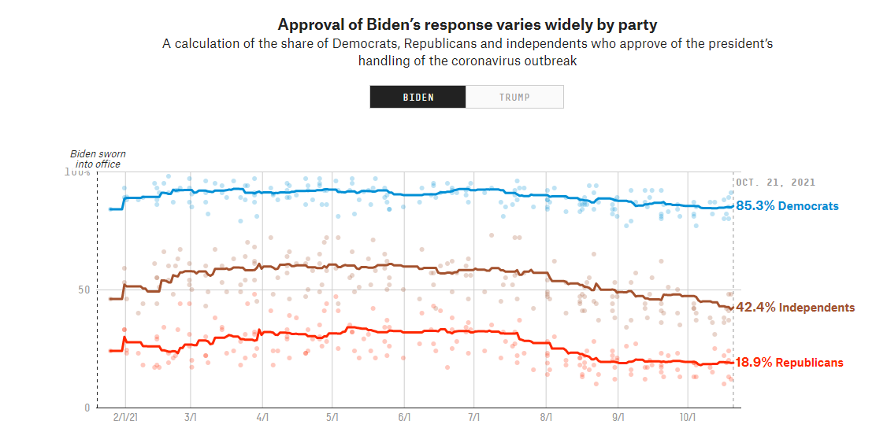
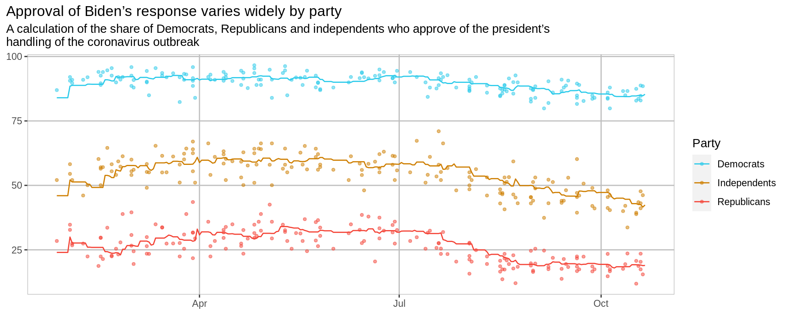
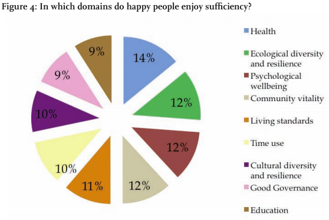
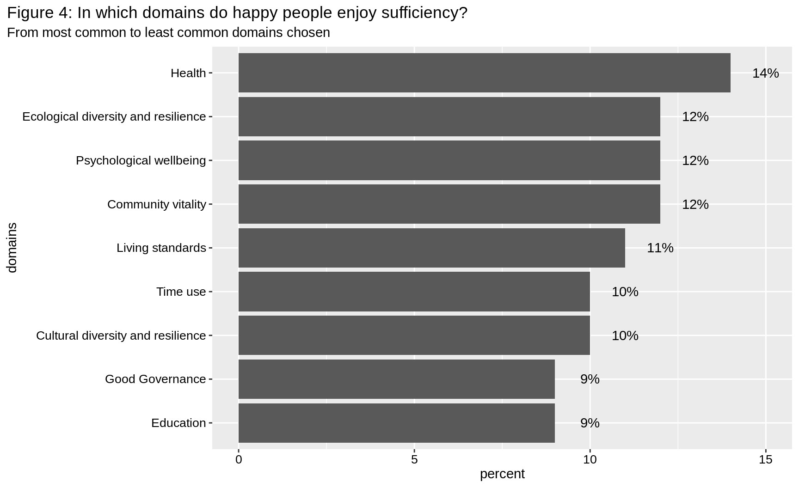
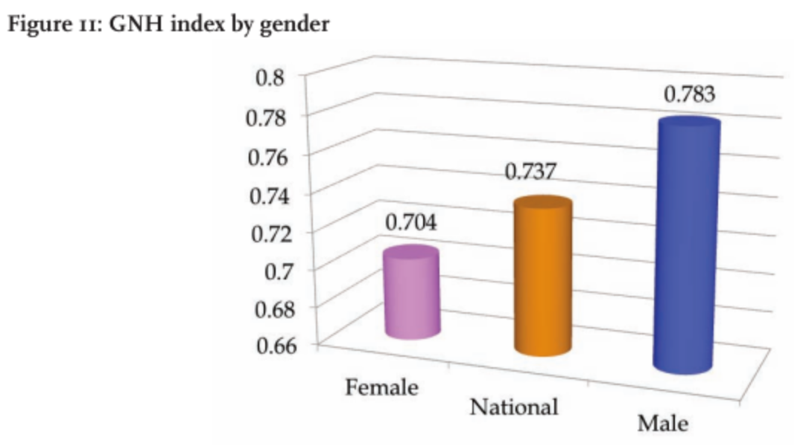
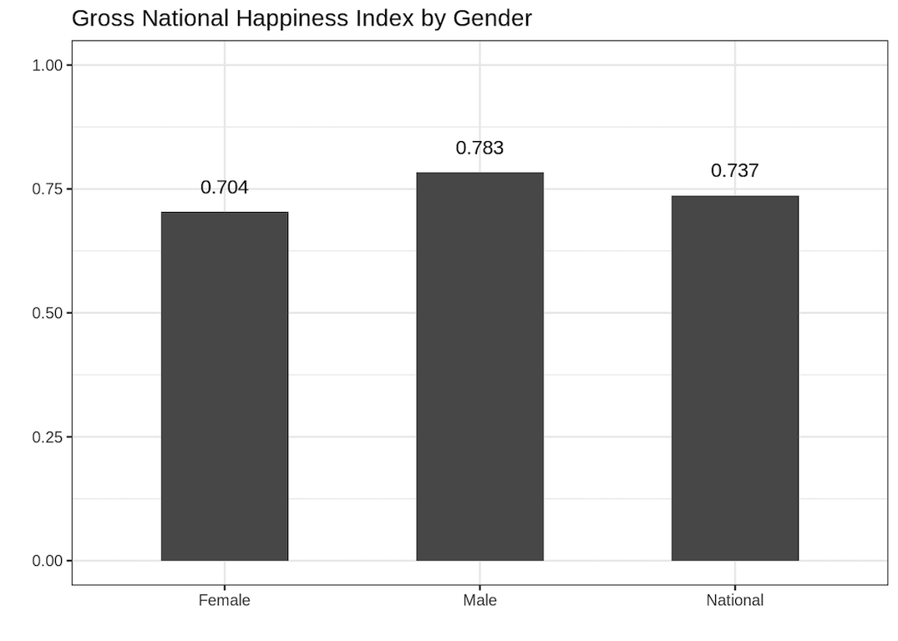
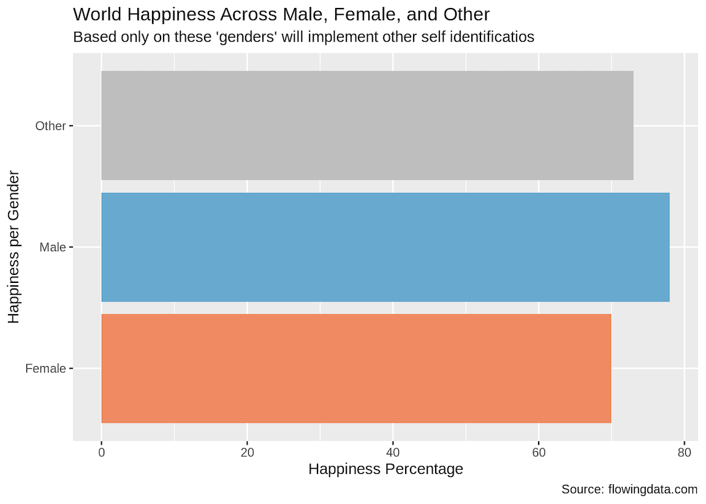

```{r packages, echo=FALSE, message=FALSE, warning=FALSE}
library(tidyverse)
library(palmerpenguins)

# For nonsese...
library(emo)
```

```{r child = "setup.Rmd"}
```

## Course Announcements

- hw03 due tonight
- lab04 grades posted
- [**Mid-course Survey**](https://docs.google.com/forms/d/e/1FAIpQLScyO_RW1yfvVtDX160kbzh2dwDaD_4EI4HaQWaYN0uueWve2A/viewform?usp=sf_link) (*optional*; due tonight for extra credit)

--

Group repos were created:
- If you were not in a group, you should have received an email
- I'll work to finalize groups today
- hw03 and cs01 submitted in the same document (we'll just grade them at different points)

---

## HW02 : Q1

Generate a visualization that will allow readers to determine whether male or female penguins are larger (by mass).


---

### Boxplot

.panelset[

.panel[.panel-name[Plot]
```{r ref.label="boxplot-q1", echo = FALSE, out.width="100%"}
```
]
.panel[.panel-name[Code]
```{r boxplot-q1, fig.show = "hide"}
penguins |>
  drop_na() |> 
  ggplot(aes(x = sex, y = body_mass_g)) +
  geom_boxplot() +
  labs(title = "Penguin body mass by sex", 
       y = "body mass (g)") +
  theme(plot.title.position = "plot")
```
]


]

---

### Histogram

.panelset[

.panel[.panel-name[Plot]
```{r ref.label="histogram-q1", echo = FALSE, out.width="100%"}
```
]

.panel[.panel-name[Code]
```{r histogram-q1, fig.show = "hide"}
penguins |>
  filter(!is.na(sex)) |>
  ggplot(mapping = aes(x = body_mass_g, fill = sex)) +
  geom_histogram() +
  labs(
    title = 'Body Mass Distribution by Sex',
    x = 'Body Mass (g)',
    y = 'Count',
    color = 'Sex'
  )
```
]


]

---

### Faceted Histograms


.panelset[

.panel[.panel-name[Plot]
```{r ref.label="histogram-facet-q1", echo = FALSE, out.width="100%"}
```
]
.panel[.panel-name[Code]
```{r histogram-facet-q1, fig.show = "hide"}
penguins |>
  filter(!is.na(body_mass_g)) |>
  ggplot(., mapping=aes(y=body_mass_g)) + 
  geom_histogram(binwidth=100) +
  facet_grid(. ~ sex) + 
  labs(
    title='Frequency of Penguins based on their Body mass and Female/Male Penguins',
    x='Frequency / Count',
    y='Body Mass (of penguins, in g (grams))')

```
]

]


    
    
---

## HW02 : Q2

Generate a barplot that visualizes how many penguins there are from each species on each island. Each island should be a different panel (in a 1 row x 3 columns visualization), and each chart should visualize the species count.


---

### Barplot 

.panelset[

.panel[.panel-name[Plot]
```{r ref.label="barplot-nocolor-q2", echo = FALSE, out.width="100%"}
```
]
.panel[.panel-name[Code]
```{r barplot-nocolor-q2, fig.show = "hide"}
ggplot(penguins, aes(x = species)) +
  geom_bar() +
  facet_wrap(~ island) +
  labs(title = "Count of species per island") +
  theme(plot.title.position = "plot")
```
]


]

---

### Barplot with color

.panelset[

.panel[.panel-name[Plot]
```{r ref.label="barplot-color-q2", echo = FALSE, out.width="100%"}
```
]
.panel[.panel-name[Code]
```{r barplot-color-q2, fig.show = "hide"}
  ggplot(penguins, aes(x = fct_infreq(species), fill = species)) +
  geom_bar() +
  facet_wrap(~island, nrow = 1) +
  guides(fill = "none") + 
  labs(
    title = "Count of Penguin Species Across the Palmer Archipelago Islands",
    x = "Species",
    y = "Number of Penguins"
  )
```
]


]

---

## HW02 : Q3

Generate a scatterplot that will allow the viewer to determine whether flipper length has differed over time. Be sure to color the points on this plot by species.


---

### Scatterplot (no jitter)

.panelset[

.panel[.panel-name[Plot]
```{r ref.label="scatterplot-nojitter-q3", echo = FALSE, out.width="100%"}
```
]
.panel[.panel-name[Code]
```{r scatterplot-nojitter-q3, fig.show = "hide"}
ggplot(penguins, aes(x = year, 
           y = flipper_length_mm,
           color = species)) +
geom_point() + 
scale_color_viridis_d() +
scale_x_continuous(n.breaks = 3) +
labs(
  title = "Flipper Lengths of Penguin Species Over Time",
  color = "Species",
  x = "Year",
  y = "Flipper Length (mm)"
)
```
]


]

---

### Scatterplot (w/ jitter)

.panelset[

.panel[.panel-name[Plot]
```{r ref.label="scatterplot-jitter-q3", echo = FALSE, out.width="100%"}
```
]
.panel[.panel-name[Code]
```{r scatterplot-jitter-q3, fig.show = "hide"}
ggplot(penguins,
       mapping = aes(x = year,
                     y = flipper_length_mm,
                     color = species)) +
  scale_color_viridis_d() +
  geom_jitter(na.rm = TRUE) +
  labs(title = "Flipper length of different penguin species by year",
       y = "Flipper length (mm)",
       x = "Year") +
  theme(plot.title.position = "plot")
```
]


]

---

## HW02 : Part II 

Imitation is the highest form of flattery


---

.panelset[

.panel[.panel-name[Pre]

]
.panel[.panel-name[Post]

]


.panel[.panel-name[Code-data]
.small[
Code by: Cheng Chang

```{r, part2-code-data, fig.show = "hide"}
# get data
poll <- read_csv("https://raw.githubusercontent.com/fivethirtyeight/covid-19-polls/master/covid_approval_polls_adjusted.csv")
poll_mean <- read_csv("https://raw.githubusercontent.com/fivethirtyeight/covid-19-polls/master/covid_approval_toplines.csv")

poll <- poll |>
  filter(subject == "Biden", party != "all") |>
  mutate(Party=case_when(party == "D" ~ "Democrats",
                         party == "I" ~ "Independents",
                         party == "R" ~ "Republicans")) |>
  mutate(enddate=as.Date(enddate, format="%m/%d/%Y"))

poll_mean <- poll_mean |>
  filter(subject == "Biden", party != "all") |>
  mutate(Party=case_when(party == "D" ~ "Democrats",
                         party == "I" ~ "Independents",
                         party == "R" ~ "Republicans")) |>
  mutate(modeldate=as.Date(modeldate, format="%m/%d/%Y"))
```
]
]
.panel[.panel-name[Code-plot]
.small[
Code by: Cheng Chang

```{r, part2-codeplot, fig.show = "hide"}
ggplot() +
  geom_point(data=poll,
             aes(x=enddate, y=approve_adjusted, color=Party),
             size=1,
             alpha = 0.5) +
  geom_path(data=poll_mean, aes(x=modeldate, y=approve_estimate, color=Party)) +
  labs(title="Approval of Biden’s response varies widely by party",
       subtitle=
         "A calculation of the share of Democrats, Republicans and independents who approve of the president’s\nhandling of the coronavirus outbreak",
       x=NULL,
       y=NULL) +
  scale_color_manual(values = c("Democrats" = "#2acaea",
                                "Independents" = "#ce7e00",
                                "Republicans" = "#f44336")) +
  theme(plot.title.position = "plot",
        panel.grid.major = element_line(color="grey"),
        panel.border = element_rect(fill=NA, color="grey"),
        panel.background = element_rect(fill="white"))
```
]
]
]

---


## HW03 : Part III 

Take a Sad Plot & Make It Better

---

### Happiness 

.panelset[

.panel[.panel-name[Pre]

]
.panel[.panel-name[Post]

]

]
---

.panelset[

.panel[.panel-name[Pre]

]
.panel[.panel-name[Post_v1]

]
.panel[.panel-name[Post_v2]

]
.panel[.panel-name[Code_v2]

Code by: Brandon Vazquez-tellez
.small[
```{r, part3-code, fig.show = "hide"}
# create tibble
hap_rep <- tibble(
  hap_rating = c(
    rep("Female", 70), rep("Other", 73), rep("Male", 78)
  )
)

# generate plot
ggplot(hap_rep, aes(y = hap_rating, fill = hap_rating)) +
  geom_bar() +
  labs(x = "Happiness Percentage",
       y = "Happiness per Gender",
       title = "World Happiness Across Male, Female, and Other",
       subtitle = "Based only on these 'genders' will implement other self identificatios",
       caption = "Source: flowingdata.com") +
  guides(fill = "none") +
  scale_fill_manual(values = c("Other" = "gray",
                               "Male" = "#67a9cf",
                               "Female" ="#ef8a62"))

```
]

]


]
---